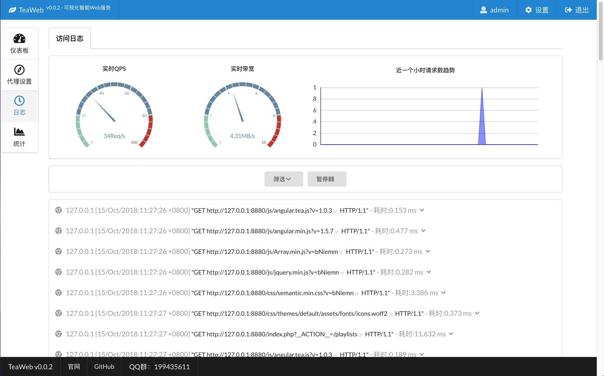

# TeaWeb - 可视化智能Web服务
TeaWeb是一款集静态资源、缓存、代理、统计、监控于一体的可视化智能WebServer。

# 架构 
~~~
             |--------------|       |----------------------------| 
Client  <->  | TeaWeb:7777  |  <->  | Nginx, Apache, Tomcat,     |
             |--------------|       | Fastcgi, Static Files, ... |
                  |                 |----------------------------|
                  |
                  |
             |-------------|        |-------------|
             |  Web        |        | [Plugins]   | 
             |  Proxy      |  <--   |  Apps       |
             |  Log        |        |  Widgets    |
             |  Monitor    |        |  Filters    |
             |  Statistics |        |-------------|
             |  Security   |
             |  ...        |
             |-------------|
~~~

# 故事 
在无数的深夜里，我们不停地下载、安装各式各样的产品：监控是一套、统计是一套、日志收集又是一套。。。

大量不同的开源组合，固然免费，但又要去学习每一套软件如何使用，花了很多时间，做了很多事情之后，尝试各种不同的配置，你会惊奇地发现，自己的系统并没有因此而变得强壮而稳定。

`TeaWeb` 不是为了做一个很强大的集各种功能于一身的管理系统，而是**做一个能让程序员、Linux系统管理员、测试工程师，喝着茶，唱着歌，就能把事情完成的一个智能化的简单易用的产品**。

何为"智能化"？`TeaWeb`会智能发现软件服务、智能提醒软件状态、智能提供性能优化建议，无需太多的配置，当你启动的时候，一切都为你准备好了。

# 预览

# 已经构建好的版本
[在这里查看Release版本](https://github.com/TeaWeb/build/releases)。

# 快速启动
**注意** 要运行TeaWeb需要你安装[MongoDB](https://www.mongodb.com/)

1. 下载对应的Release版本，目前只支持MacOS(darwin)和Linux两个版本；
2. 使用unzip解压到某个目录，比如 teaweb-v0.0.1/；
3. 然后执行：
    ~~~shell
    cd teaweb-v0.0.1/
    bin/teaweb start
    ~~~
4. 如果没有出现错误的话，可以在浏览器中访问：
    ~~~
    http://127.0.0.1:7777
    ~~~
    其中`127.0.0.1`可能需要换成你服务器的IP，而且我们默认使用了`7777`端口（可以在`configs/server.conf`中修改），如果访问遇到了问题，请检查防火墙设置；
5. 使用用户名`admin`和密码`123456`登录，可以在`configs/admin.conf`中修改这些信息。

# 构建自己的版本    
1. 从 *https://github.com/TeaWeb/build* 中下载项目，放到本地磁盘上；
2. 设置全局变量`GOPATH`为项目目录路径；
3. 执行`init.sh`初始化项目；
4. 执行`run.sh`启动项目；
5. 在浏览器中访问`http://127.0.0.1:7777`。

# 扩展TeaWeb
* [如何实现自己的插件](https://github.com/TeaWeb/plugin)

# 在线演示
[点击这里查看在线演示的版本](http://meloy.cn:7777/)

# 报告问题
请在 *https://github.com/TeaWeb/build/issues* 报告你所遇到的问题，或者加入QQ群199435611跟大家一起讨论.

# 相关源码
* [主项目Go语言源码](https://github.com/TeaWeb/code)
* [插件Go语言源码](https://github.com/TeaWeb/plugin)

# 感谢
* [Semantic UI](https://semantic-ui.com) - 一个非常好用的UI组件库
* [Vue.js](https://cn.vuejs.org/) - 支持双向绑定的DOM操作库
* [Axios](https://github.com/axios/axios) - 一个好用的HTTP客户端
* [echarts](http://echarts.baidu.com/) - 一个很酷炫的图表库
* [geolite](https://dev.maxmind.com/geoip/legacy/geolite/) - Geo-IP数据库
* [BrowserScope](http://www.browserscope.org/) - 社区驱动的Web浏览器信息聚合平台
* [Array.js](https://github.com/iwind/Array.js) - 帮助开发人员更优雅地操作Javascript数组
* [gofcgi](https://github.com/iwind/gofcgi) - golang client for fastcgi
* [go msgpack](https://github.com/vmihailenco/msgpack) - Go语言版本的msgpack
* [go psutil](https://github.com/shirou/gopsutil) - Go语言版本的psutil
