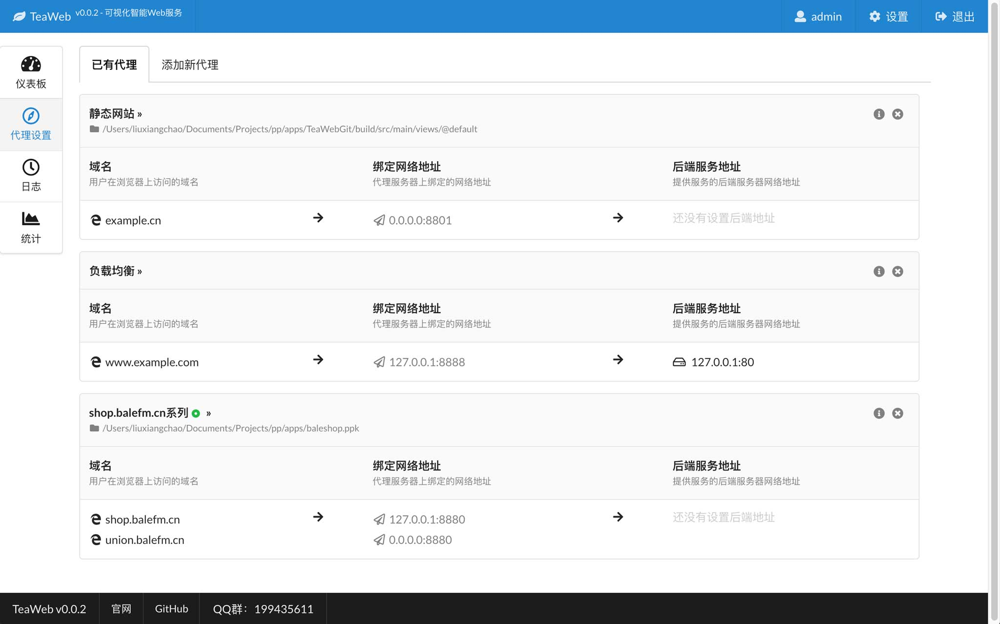

# TeaWeb - 可视化智能Web服务
TeaWeb集静态资源、缓存、代理、统计、监控于一体的可视化智能WebServer。

# 架构 
~~~
             |---------|       |----------------------------| 
Client  <->  | TeaWeb  |  <->  | Nginx, Apache, Tomcat,     |
             |---------|       | Fastcgi, Static Files, ... |
               Web             |----------------------------|
               Proxy
               Log
               Monitor
               Statistics
               Security
               ...
~~~

# 故事 
在无数的深夜里，我们不停地下载、安装各式各样的产品：监控是一套、统计是一套、日志收集有是一套。。。

冷静想下来，我们经历过的产品有几个能坚持很久并能成功的？我们在不成功的产品上，花了太多的时间去做周边的事情，而不是专注于业务。

大量不同的开源组合，固然免费，但又要去学习每一套软件如何使用，花了很多时间，做了很多事情之后，尝试各种不同的配置，你会惊奇地发现，自己的系统并没有因此而变得强壮而稳定。

`TeaWeb` 不是为了做一个很强大的集各种功能于一身的管理系统，而是**做一个能让程序员、Linux系统管理员、测试工程师，喝着茶，唱着歌，就能把事情完成的一个智能化的简单易用的产品**。

何为"智能化"？`TeaWeb`会智能发现软件服务、智能提醒软件状态、智能提供性能优化建议，无需太多的配置，当你启动的时候，一切都为你准备好了。

# 预览

# 感谢
* [Semantic UI](https://semantic-ui.com) - 一个非常好用的UI组件库
* [Vue.js](https://cn.vuejs.org/) - 支持双向绑定的DOM操作库
* [Axios](https://github.com/axios/axios) - 一个好用的HTTP客户端
* [echarts](http://echarts.baidu.com/) - 一个很酷炫的图表库