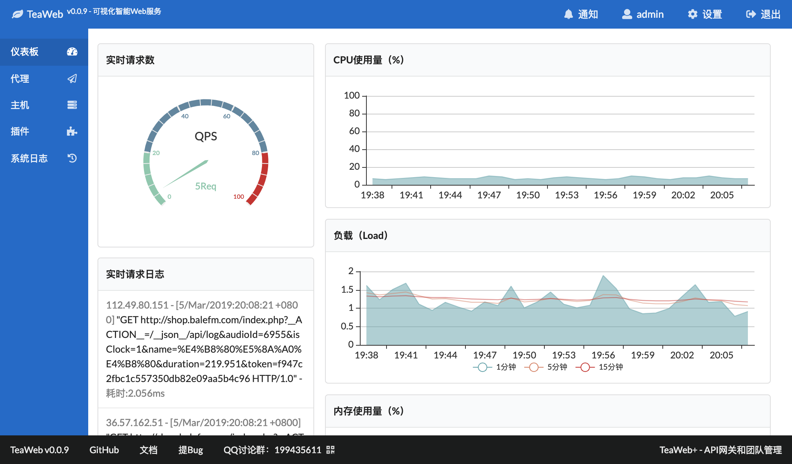
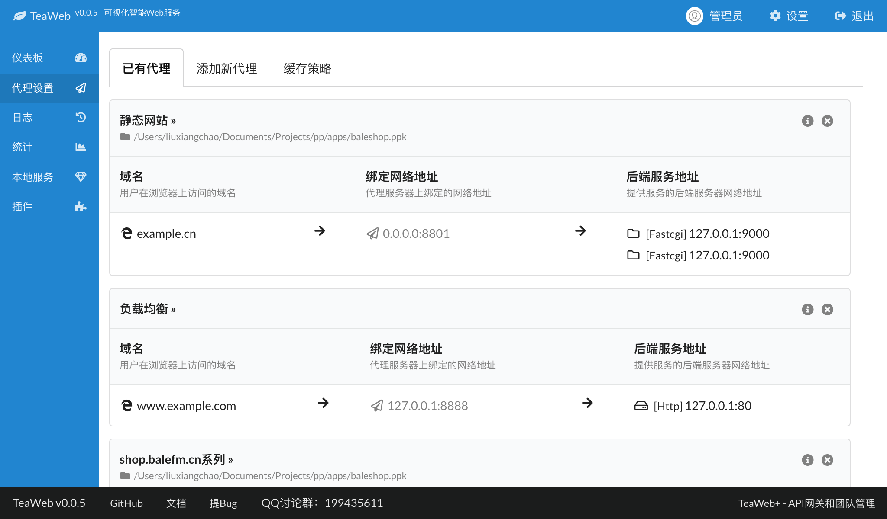
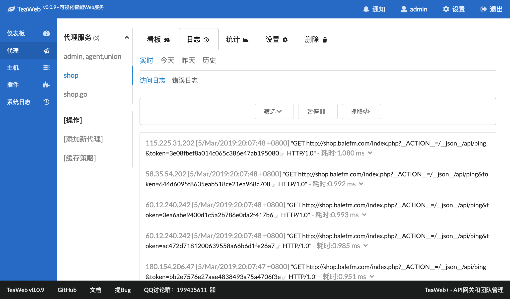

# TeaWeb - 可视化的Web代理服务
TeaWeb是一款集静态资源、缓存、代理、统计、日志、安全、监控于一体的可视化智能WebServer。目标是 **做一个能让程序员和运维工程师喝着茶、唱着歌，就能把事情完成的一个智能化的简单易用的产品**。

TeaWeb使用Go语言实现，在高可定制化前提下，保证高性能、高并发。

加入QQ群199435611、微信liuxiangchao（"刘祥超"的全拼）跟大家一起讨论，也可以发送邮件到 `root@teaos.cn`。

# 架构 
~~~
             |--------------|        |----------------------------| 
Client  <->  | TeaWeb:7777  |   <->  | Nginx, Apache, Tomcat,     |
             |--------------|        | Fastcgi, Static Files, ... |
                   |                 |----------------------------|
                   |
                   |
             |-------------|
             |  Web        |     
             |  Proxy      |  
             |  Log        |  
             |  Monitor    |      
             |  Statistics |     
             |  WAF        |
             |  Cache      |
             |  ...        |
             |-------------|
~~~

# 预览

# 常用链接
* [在线演示](http://teaos.cn:7777/)
* [下载二进制版本](http://teaos.cn/download)
* [安装](http://teaos.cn/doc/main/Install.md)
* [升级](http://teaos.cn/doc/main/Upgrade.md)
* [从源码启动或编译](http://teaos.cn/doc/main/Build.md)
* [Docker Composer](https://github.com/tossp/teaweb-build) - 感谢tossp网友
* [文档](http://teaos.cn/doc)
* QQ群：199435611

# 微信赞赏
如果你觉得本项目对有所帮助，可以使用微信扫描以下赞赏二维码：

# 报告问题
请在 *https://github.com/TeaWeb/build/issues* 报告你所遇到的问题，或者加入QQ群199435611、微信liuxiangchao（"刘祥超"的全拼）跟大家一起讨论，也可以发送邮件到 `root@teaos.cn`。

# 感谢
* [Semantic UI](https://semantic-ui.com) - 一个非常好用的UI组件库
* [Vue.js](https://cn.vuejs.org/) - 支持双向绑定的DOM操作库
* [Axios](https://github.com/axios/axios) - 一个好用的HTTP客户端
* [echarts](http://echarts.baidu.com/) - 一个很酷炫的图表库
* [geolite](https://dev.maxmind.com/geoip/legacy/geolite/) - Geo-IP数据库
* [BrowserScope](http://www.browserscope.org/) - 社区驱动的Web浏览器信息聚合平台
* [Array.js](https://github.com/iwind/Array.js) - 帮助开发人员更优雅地操作Javascript数组
* [gofcgi](https://github.com/iwind/gofcgi) - golang client for fastcgi
* [go msgpack](https://github.com/vmihailenco/msgpack) - Go语言版本的msgpack
* [go psutil](https://github.com/shirou/gopsutil) - Go语言版本的psutil
* [CodeMirror](https://codemirror.net/) - 一个很好的在线代码编辑器
* [gorilla-websocket](https://github.com/gorilla/websocket) - A WebSocket implementation for Go.
