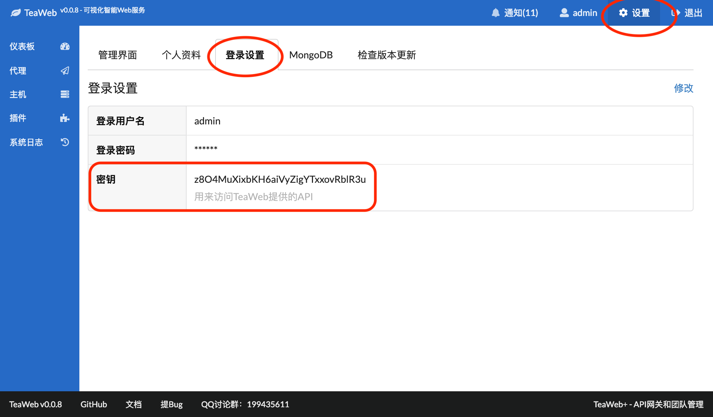

# 外部监控API
如果你想在外部监控TeaWeb，可以通过API实现，API地址为：
~~~
http://TeaWeb访问地址/api/monitor?TeaKey=登录用户密钥
~~~
把上面的"TeaWeb访问地址"换成你的TeaWeb实际访问地址，当然也有可能是`https://TeaWeb访问地址`。

然后在"设置">"登录设置"中可以查看你的用户密钥：

如果还没有生成KEY，点击生成即可。

把密钥填到上面最开始的URL中，即可使用GET方法访问，组合后的网址类似于：
~~~
http://127.0.0.1:7777/api/monitor?TeaKey=z8O4MuXixbKH6aiVyZigYTxxovRblR3u
~~~

请求结果是一个JSON，类似于：
~~~javascript
{
  "arch": "amd64",
  "heap": 12685664,
  "memory": 74840312,
  "mongo": true,
  "os": "darwin",
  "routines": 98,
  "version": "0.0.8"
}
~~~

其中：
* `arch` - CPU架构
* `heap` - Heap值（字节）
* `memory` - 总内存值（字节）
* `mongo` - MongoDB连接是否正常
* `os` - 操作系统代号
* `routines` - go routine数量
* `version` - TeaWeb版本
