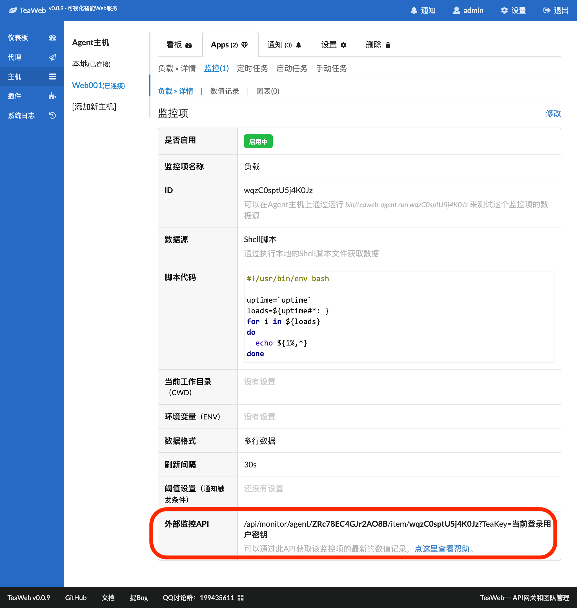

# 主机监控项API
从v0.0.9开始，可以通过API获取TeaWeb中App某个监控项的最新数值记录，API监控URL为：
~~~
http://TeaWeb访问地址/api/monitor/主机ID/item/监控项ID?TeaKey=登录用户密钥
~~~
可以通过`GET`和`POST`请求此URL，其中：
* "TeaWeb访问地址"换成你的TeaWeb实际访问地址，当然如果你开启了HTTPS，也可以是`https://TeaWeb访问地址`
* `登录用户密钥` - 可以在"设置">"登录设置"中可以查看，[api_monitor1.png](api_monitor1.png)
* `主机ID` - 可以在主机"设置"中查看
* `监控项ID` - 可以在监控项详情中查看

为了用户方便，我们在监控项详情中加入了`外部监控API`：

## 数据格式
获取的数据格式同数值记录一致。
