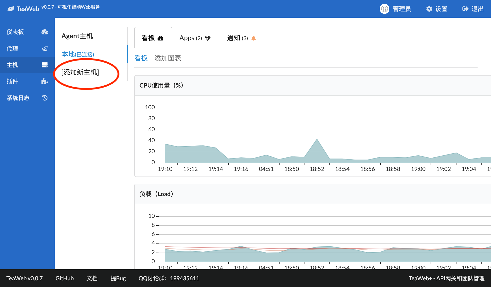
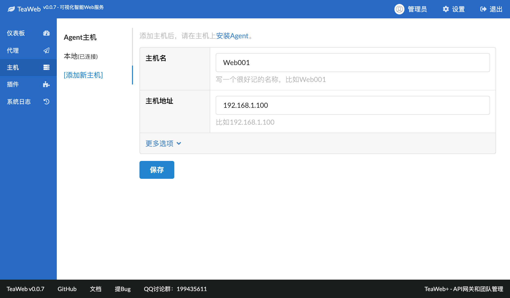
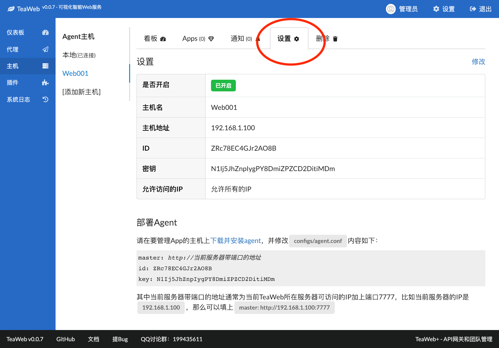

# 安装Agent
## 步骤1：添加一个Agent主机
点击下图中的"添加新主机"：

在出现的表单中填入主机名和主机地址，这两项都没有严格的要求，只要能表明主机的用途和主机的地址就好：

点击上图中的"保存"，即可保存成功。

## 步骤2：查看部署的配置
点击刚添加的主机对应的"设置"按钮，会出现以下界面：

可以在这个界面上看到主机的ID（`id`）和密钥（`key`）。

## 步骤3：下载并部署Agent
在 [http://teaos.cn/download](http://teaos.cn/download) 下载对应平台的Agent版本，解压后用编辑器打开`configs/agent.conf`，然后修改里面的内容：
* `master` - 可以访问到Master的地址，需要带有`http://`或者`https://`；如果有必要，需要设置`iptables`或`firewall`；
* `id` - 将此值修改为步骤2看到的ID；
* `key` - 将此值修改为步骤2看到的密钥。

### 测试
使用以下脚本测试连接：
~~~bash
bin/teaweb-agent test
~~~

### 启动
如果测试后同Master的连接没有错误，则可以启动Agent：
~~~bash
bin/teaweb-agent start
~~~

启动后，可以在`logs/run.log`中看运行的日志。

## 更多命令
除了测试和启动命令外，还提供了以下几个命令：
~~~bash
# 查看帮助
bin/teaweb-agent help

# 测试和主服务器连接
bin/teaweb-agent test

# 在前端运行，阻塞当前命令窗口
bin/teaweb-agent 

# 启动
bin/teaweb-agent start

# 停止
bin/teaweb-agent stop

# 重启
bin/teaweb-agent restart 

# 手动执行任务，123456是任务ID示例
bin/teaweb-agent run 123456

# 手动执行监控项数据源，123456是监控项ID示例
bin/teaweb-agent run 123456

# 查看Agent版本（从v0.1.1开始支持）：
bin/teaweb-agent version
~~~

## Windows系统
在Windows系统上，需要将相关命令改成：
~~~bash
bin\teaweb-agent.exe xxx
~~~

## 开机启动
在Linux上可以设置开机启动服务，具体 [看这里](http://teaos.cn/doc/main/Install.md#%E5%BC%80%E6%9C%BA%E5%90%AF%E5%8A%A8%E8%84%9A%E6%9C%AC)。