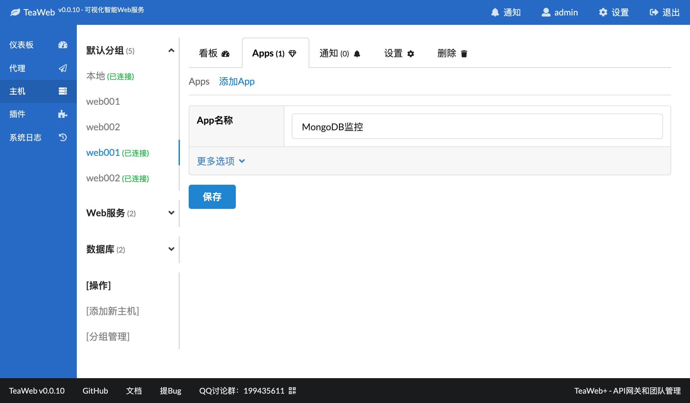
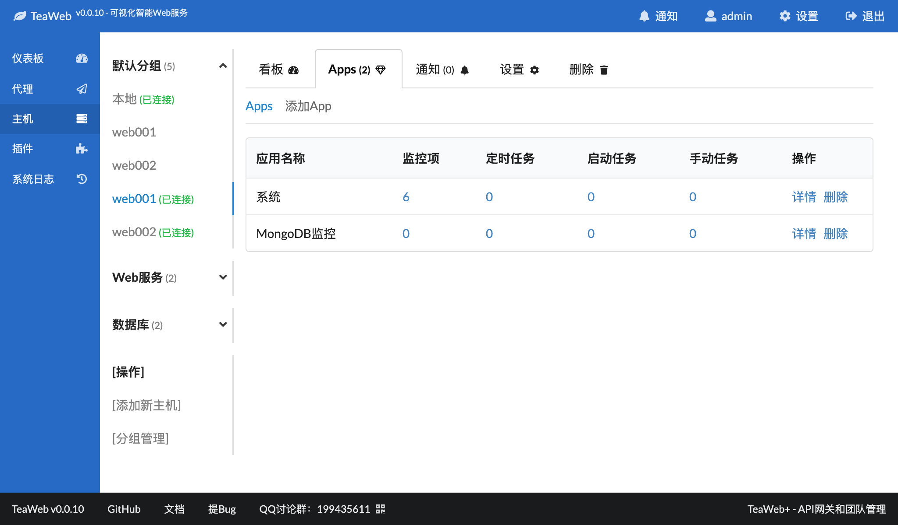
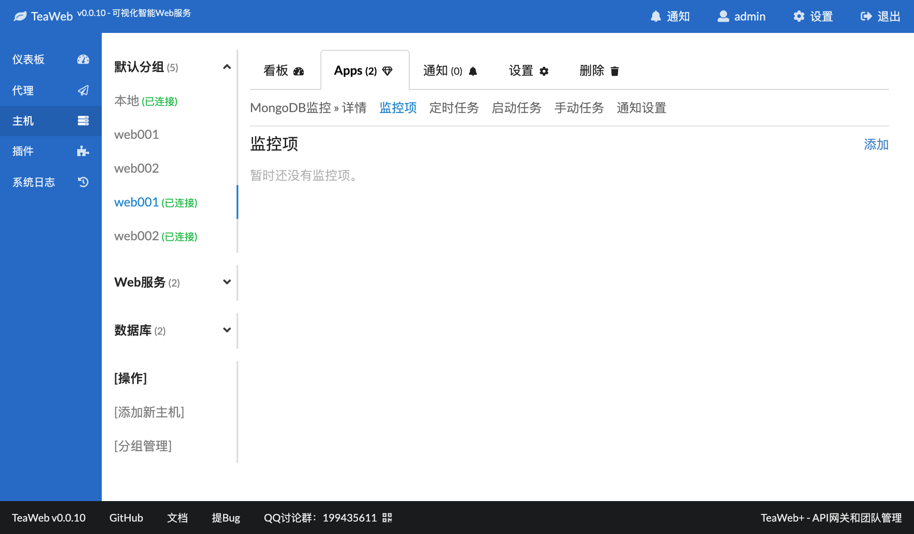
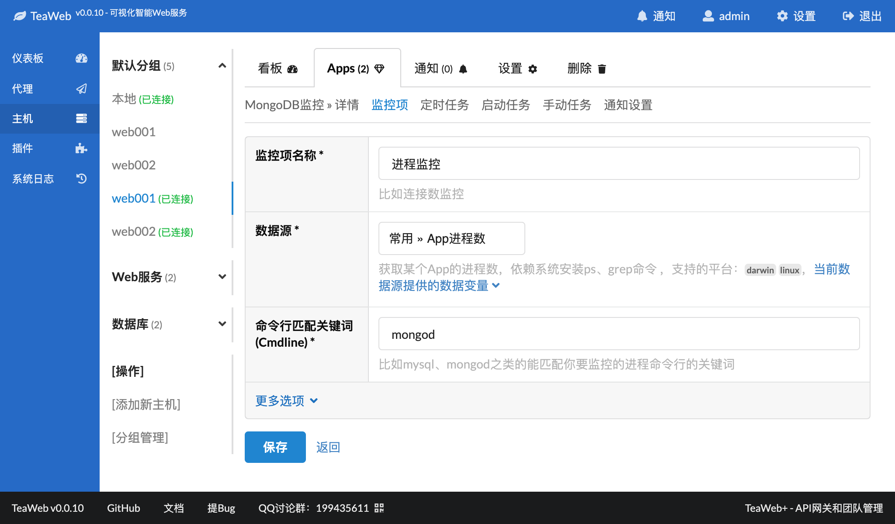
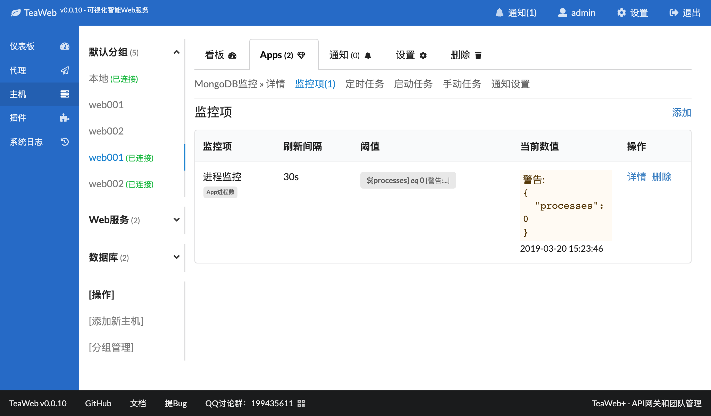
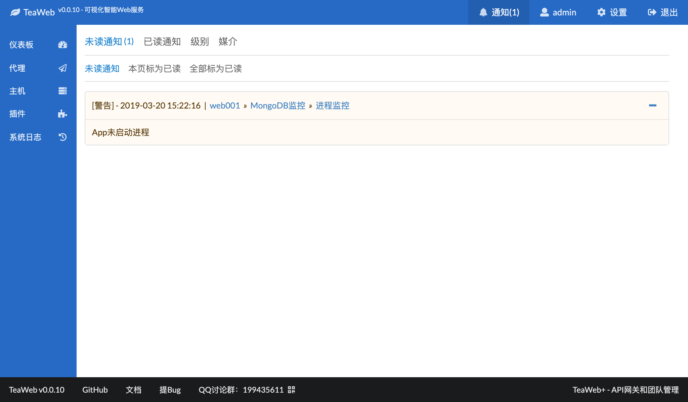

# 监控实例-监控进程
下面以监控MongoDB进程为例，演示如何监控一个进程，步骤为：
1. 新建一个App，叫"MongoDB监控"
2. 在这个App中添加一个监控项"进程监控"
3. 查看监控结果

## 新建App
在某个主机上点击"Apps"选项卡，点击"添加App"进入以下界面：

填入"MongoDB监控"，点击保存后返回App列表： 

可以看到"MongoDB监控"App已经建好了。

## 添加监控项
点击"MongoDB监控"详情，进入详情，然后选择"监控项"选项卡，进入监控项列表页：

可以看到现在是空的，点击"添加"，进入页面：

在监控项名称中填入"进程监控"，数据源选择"常用 App进程数"，在命令行匹配关键词写入`mongod`，因为MongoDB的启动命令中可执行文件就是`mongod`。

点击表格中的"更多选项"，显示：

点击阈值区域中的"添加当前数据源内置阈值模板"，即可添加一个`${processes} eq 0 ...`的阈值设置，意思是说`${processes}`的变量值如果等于`0`，则会发送一个警告。

设置好名称、数据源、阈值后，点击"保存"后回到监控项列表页： 

## 查看监控结果
等30秒之后，在监控项列表里会出现监控数值：

可以看到当前数值区域是黄色的，表示警告，也就是说检测到没有mongod进程，同时也会自动发送通知：

在主机上，启动了MongoDB之后会自动发送服务恢复通知。