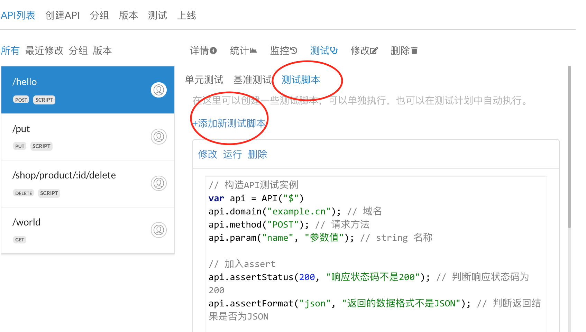
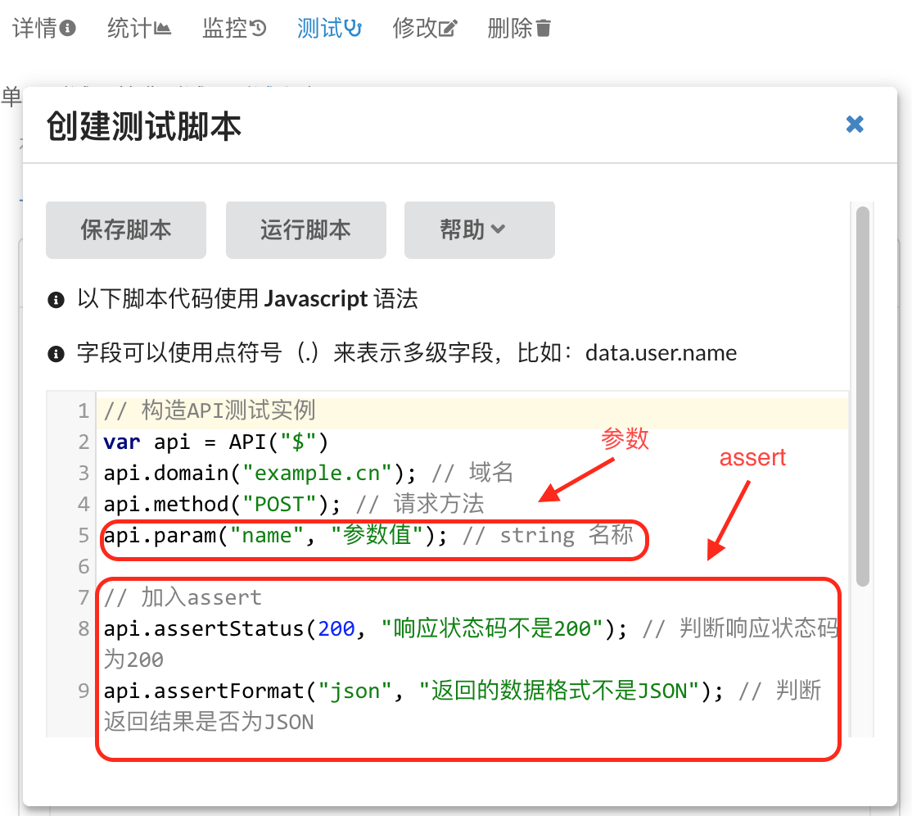

# 测试脚本
测试脚本是一组使用**Javascript**实现的代码，编写完成后，可以随时手工运行，也可以在[测试计划](TestPlan.md)自动测试。

## 创建测试脚本
在"API列表"中选择一个要测试的API，然后点击右侧"测试"菜单，再点击出现的"脚本菜单"菜单：

然后点击"添加新测试脚本"，系统会弹出一个窗口，里面已经预置了一个默认的测试脚本，可以修改其中的参数和assert部分，以满足你的需求：

其中的*assert*系列代码是一组诊断函数，用来判断返回的结果是否符合某些规则，更多的*assert*函数请看下面的内置函数。

在编写好测试脚本后，点击"运行脚本"可以立即运行一次脚本，来检查自己的脚本是否正确；点击"保存脚本"可以将脚本保存到配置文件中，以便以后随时可以运行；点击"帮助"可以看到Javascript方法帮助简要文档。

## 内置函数
测试脚本中可以默认使用以下函数（或叫做方法）：

* [API()](#api)
* [api.method()](#apimethod)
* [api.param()](#apiparam)
* [api.body()](#apibody)
* [api.repeat()](#apirepeat)
* [api.timeout()](#apitimeout)
* [api.concurrent()](#apiconcurrent)
* [api.header()](#apiheader)
* [api.remoteAddr()](#apiremoteaddr)
* [api.domain()](#apidomain)
* [api.file()](#apifile)
* [api.cookie()](#apicookie)
* [api.author()](#apiauthor)
* [api.description()](#apidescription)
* [api.assertFormat()](#apiassertformat)
* [api.assertHeader()](#apiassertheader)
* [api.assertStatus()](#apiassertstatus)
* [api.assertEqual()](#apiassertequal)
* [api.assertGt()](#apiassertgt)
* [api.assertGte()](#apiassertgte)
* [api.assertLt()](#apiassertlt)
* [api.assertLte()](#apiassertlte)
* [api.assertTrue()](#apiasserttrue)
* [api.assertFalse()](#apiassertfalse)
* [api.assertArray()](#apiassertarray)
* [api.assertLength()](#apiassertlength)
* [api.assertNotEmpty()](#apiassertnotempty)
* [api.assertEmpty()](#apiassertempty)
* [api.assertExist()](#apiassertexist)
* [api.assertNotExist()](#apiassertnotexist)
* [api.assertType()](#apiasserttype)
* [api.assert()](#apiassert)
* [api.addFailure()](#apiaddfailure)
* [api.onSuccess()](#apionsuccess)
* [api.onError()](#apionerror)
* [api.onDone()](#apiondone)

### API()
调用API，会返回一个API对象。

调用方法：
~~~javascript
apis.API("API路径");
~~~
这里有一个 `apis` ，类似于命名空间，防止同其他脚本中定义的变量冲突。

示例：
~~~javascript
var api = apis.API("$"); // 调用当前API
var api = apis.API("/hello/world"); // 调用某个特定的API 
~~~

也可以在API中增加URL参数：
~~~javascript
var api = apis.API("$?name=lu"); // 调用当前API
var api = apis.API("/hello/world?age=20&city=Beijing"); // 调用某个特定的API 
~~~

### api.method()
设置请求方法，请求方法可以为：GET, POST, ... （不区分大小写）。

调用方法：
~~~javascript
api.method("请求方法")
~~~

示例：
~~~javascript
api.method("POST");
~~~

###  api.param()
设置参数值，通常请求方法是GET或者POST的时候需要使用此方法，如果是PUT或者别的方法，请参看下面的*api.body()*。

调用方法：
~~~javascript
api.param("参数名", "参数值");
~~~

示例：
~~~javascript
api.param("name", "lu");
api.param("age", 20);
~~~

### api.body()
设置PUT、DELETE等方法要上传的内容，

调用方法：
~~~javascript
api.body("要上传的内容");
~~~

示例：
~~~javascript
api.body('{"code":200, "data":{ "name":"lu", "age":20 }}');
~~~

也可以直接使用一个对象：
~~~javascript
api.body({
    "code": 200,
    "data": {
        "name": "lu",
        "age": 20
    }
});
~~~

### api.repeat() 
设置重复执行次数，重复次数是个数字。

调用方法：
~~~javascript
api.repeat(重复次数);
~~~

示例：
~~~javascript
api.repeat(5);
~~~

       
### api.timeout()
设置超时时间，秒数是一个数字。

调用方法：
~~~javascript
api.timeout(秒数);
~~~

示例：
~~~javascript
api.timeout(30);
~~~

### api.concurrent()
设置并发数，并发数是一个数字，通常是和 *api.repeat()* 组合起来使用。

调用方法：
~~~javascript
api.concurrent(并发数);
~~~

示例：
~~~javascript
api.concurrent(10);
~~~

### api.header()
设置header。

调用方法：
~~~javascript
api.header("名称", "值");
~~~

示例：
~~~javascript
api.header("User-Agent", "Mozilla/5.0 Chrome/70.0.3538.102 Safari/537.36");
~~~

### api.remoteAddr()
设置客户端地址，通常是一个IP。

调用方法：
~~~javascript
api.remoteAddr("客户端地址");
~~~

示例：
~~~javascript
api.remoteAddr("192.168.1.100");
~~~

### api.domain()
设置域名，本质上是在 *Header* 中设置 *Host* 选项值。

调用方法：
~~~javascript
api.domain("域名");
~~~

示例：
~~~javascript
api.domain("example.com");
~~~
  
### api.file()
设置要上传的文件。

调用方法：
~~~javascript
api.file("参数名", "文件路径");
~~~
其中*文件路径*一定要是绝对路径。

示例：
~~~javascript
api.file("avatarFile", "/home/tests/avatar.png");
~~~

### api.cookie()
设置cookie。

调用方法：
~~~javascript
api.cookie("名称", "值");
~~~

示例：
~~~javascript
api.cookie("sid", "123456");
~~~

### api.author()
设置脚本作者。

调用方法：
~~~javascript
api.author("脚本作者");
~~~

示例：
~~~javascript
api.author("李白");
~~~

### api.description()
设置脚本描述。

调用方法：
~~~javascript
api.description("脚本描述");
~~~

示例：
~~~javascript
api.description("测试用户登录是否正常");
~~~
      
### api.assertFormat()
判断返回数据格式，目前只支持json，如果失败则显示错误消息，错误消息参数可以省略。

调用方法：
~~~javascript
api.assertFormat("格式", "错误消息");
~~~

示例：
~~~javascript
api.assertFormat("json");
~~~

注意：目前只支持参数为"json"。
      
### api.assertHeader()
判断返回的Header中的字段值，如果失败则显示错误消息，错误消息参数可以省略。

调用方法：
~~~javascript
api.assertHeader("名称", "值", "错误消息")
~~~

示例：
~~~javascript
api.assertHeader("Content-Type", "application/json; charset=utf-8", "返回的Content-Type错误")
~~~
     
### api.assertStatus()
判断返回的状态码，如果失败则显示错误消息，错误消息参数可以省略。

调用方法：
~~~javascript
api.assertStatus(状态码, "错误消息");
~~~

示例：
~~~javascript
api.assertStatus(200);
~~~
   
### api.assertEqual()
判断字段值，如果失败则显示错误消息，错误消息参数可以省略。

调用方法：
~~~javascript
api.assertEqual("字段", "值", "错误消息");
~~~

示例：
~~~javascript
api.assertEqual("code", 10000);

/**
// 示例数据
{
    "code": 10000,
    "data": {
        "name": "lu",
        "age": 20,
        "books": [ "Golang", "Python", "PHP" ],
        "isVip": true
    }
}
**/
~~~

### api.assertGt()
判断字段值是否大于某个数值，如果失败则显示错误消息，错误消息参数可以省略。

调用方法：
~~~javascript
api.assertGt("字段", 数值, "错误消息");
~~~

示例：
~~~javascript
api.assertGt("data.age", 20);

/**
// 示例数据
{
    "code": 200,
    "data": {
        "name": "lu",
        "age": 20,
        "books": [ "Golang", "Python", "PHP" ],
        "isVip": true
    }
}
**/
~~~

### api.assertGte()
判断字段值是否大于或等于某个数值，如果失败则显示错误消息，错误消息参数可以省略。

调用方法：
~~~javascript
api.assertGte("字段", 数值, "错误消息")
~~~

示例：
~~~javascript
api.assertGte("data.age", 20);

/**
// 示例数据
{
    "code": 200,
    "data": {
        "name": "lu",
        "age": 20,
        "books": [ "Golang", "Python", "PHP" ],
        "isVip": true
    }
}
**/
~~~

### api.assertLt()
判断字段值是否小于某个数值，如果失败则显示错误消息，错误消息参数可以省略。

调用方法：
~~~javascript
api.assertLt("字段", 数值, "错误消息");
~~~

示例：
~~~javascript
api.assertLt("data.age", 20);

/**
// 示例数据
{
    "code": 200,
    "data": {
        "name": "lu",
        "age": 20,
        "books": [ "Golang", "Python", "PHP" ],
        "isVip": true
    }
}
**/
~~~

### api.assertLte()    
判断字段值是否小于或等于某个数值，如果失败则显示错误消息，错误消息参数可以省略。

调用方法：
~~~javascript
api.assertLte("字段", 数值, "错误消息");
~~~

示例：
~~~javascript
api.assertLte("data.age", 20);

/**
// 示例数据
{
    "code": 200,
    "data": {
        "name": "lu",
        "age": 20,
        "books": [ "Golang", "Python", "PHP" ],
        "isVip": true
    }
}
**/
~~~
        
    
### api.assertTrue()
判断字段值是否为true，如果失败则显示错误消息，错误消息参数可以省略。

调用方法：
~~~javascript
api.assertTrue("字段", "错误消息");
~~~

示例：
~~~javascript
api.assertTrue("data.isVip");

/**
// 示例数据
{
    "code": 200,
    "data": {
        "name": "lu",
        "age": 20,
        "books": [ "Golang", "Python", "PHP" ],
        "isVip": true
    }
}
**/
~~~

### api.assertFalse()
判断字段值是否为false，如果失败则显示错误消息，错误消息参数可以省略。

调用方法：
~~~javascript
api.assertFalse("字段", "错误消息");
~~~

示例：
~~~javascript
api.assertFalse("data.isVip");

/**
// 示例数据
{
    "code": 200,
    "data": {
        "name": "lu",
        "age": 20,
        "books": [ "Golang", "Python", "PHP" ],
        "isVip": true
    }
}
**/
~~~

###  api.assertArray()
判断字段值是否为数组，如果失败则显示错误消息，错误消息参数可以省略。

调用方法：
~~~javascript
api.assertArray("字段", "错误消息");
~~~

示例：
~~~javascript
api.assertArray("data.books");

/**
// 示例数据
{
    "code": 200,
    "data": {
        "name": "lu",
        "age": 20,
        "books": [ "Golang", "Python", "PHP" ],
        "isVip": true
    }
}
**/
~~~
  
### api.assertLength()
判断字段长度，如果失败则显示错误消息，错误消息参数可以省略。

这个字段可以是数字、字符串或者数组。

调用方法：
~~~javascript
api.assertLength("字段", 长度数值, "错误消息");
~~~

示例：
~~~javascript
api.assertLength("data.books", 3);

/**
// 示例数据
{
    "code": 200,
    "data": {
        "name": "lu",
        "age": 20,
        "books": [ "Golang", "Python", "PHP" ],
        "isVip": true
    }
}
**/
~~~

### api.assertNotEmpty()
判断字段是否不为空，如果失败则显示错误消息，错误消息参数可以省略。

这个字段可以是数字、字符串或者数组。

调用方法：
~~~javascript
api.assertNotEmpty("字段", "错误消息");
~~~

示例：
~~~javascript
api.assertNotEmpty("data.books");

/**
// 示例数据
{
    "code": 200,
    "data": {
        "name": "lu",
        "age": 20,
        "books": [ "Golang", "Python", "PHP" ],
        "isVip": true
    }
}
**/
~~~

      
### api.assertEmpty()
判断字段是否为空，如果失败则显示错误消息，错误消息参数可以省略。    

这个字段可以是数字、字符串或者数组。

调用方法：
~~~javascript
api.assertEmpty("字段", "错误消息");
~~~

示例：
~~~javascript
api.assertEmpty("data.books");

/**
// 示例数据
{
    "code": 200,
    "data": {
        "name": "lu",
        "age": 20,
        "books": [ "Golang", "Python", "PHP" ],
        "isVip": true
    }
}
**/
~~~

### api.assertExist()
判断字段是否存在，如果失败则显示错误消息，错误消息参数可以省略。

调用方法：
~~~javascript
api.assertExist("字段", "错误消息");
~~~

示例：
~~~javascript
api.assertExist("data.books");

/**
// 示例数据
{
    "code": 200,
    "data": {
        "name": "lu",
        "age": 20,
        "books": [ "Golang", "Python", "PHP" ],
        "isVip": true
    }
}
**/
~~~

 
 ### api.assertNotExist()
判断字段是否不存在，如果失败则显示错误消息，错误消息参数可以省略。

调用方法：
~~~javascript
api.assertNotExist("字段", "错误消息");
~~~

示例：
~~~javascript
api.assertNotExist("data.books");

/**
// 示例数据
{
    "code": 200,
    "data": {
        "name": "lu",
        "age": 20,
        "books": [ "Golang", "Python", "PHP" ],
        "isVip": true
    }
}
**/
~~~

### api.assertType()
判断字段类型，类型可以为string、number、bool（或boolean）、int、float、array、object、null，如果失败则显示错误消息，错误消息参数可以省略。

调用方法：
~~~javascript
api.assertType("字段", "类型", "错误消息")
~~~

示例：
~~~javascript
api.assertType("data.name", "string");
api.assertType("data.age", "int");

/**
// 示例数据
{
    "code": 200,
    "data": {
        "name": "lu",
        "age": 20,
        "books": [ "Golang", "Python", "PHP" ],
        "isVip": true
    }
}
**/
~~~

基于 *assertType* 还有一组内置的函数可以使用：
~~~javascript
api.assertBool("字段", "错误消息");
api.assertNumber("字段", "错误消息");
api.assertString("字段", "错误消息");
api.assertInt("字段", "错误消息");
api.assertFloat("字段", "错误消息");
api.assertArray("字段", "错误消息");
api.assertObject("字段", "错误消息");
api.assertNull("字段", "错误消息");
~~~
 
### api.assert()
设置自定义的校验函数，如果正确返回true，否则返回false，如果失败则显示错误消息，错误消息参数可以省略。

调用方法：
~~~javascript
api.assert("字段", function (value) {
    return true或false;
}, "错误消息");
~~~

示例：
~~~javascript
api.assert("data.age", function (value) {
    if (value > 20) {
        return true;
    } else {
        return false;
    }
});

/**
// 示例数据
{
    "code": 10000,
    "data": {
        "name": "lu",
        "age": 20,
        "books": [ "Golang", "Python", "PHP" ],
        "isVip": true
    }
}
**/
~~~
     
### api.addFailure()
添加自定义的错误信息。

调用方法：
~~~javascript
api.addFailure("错误信息");
~~~

示例：
~~~javascript
api.addFailure("参数检查失败");
~~~

### api.onSuccess()
成功后调用。

调用方法：
~~~javascript
api.onSuccess(function (resp) {
    
});
~~~

其中的 *resp* 格式如下：
~~~
{
    "status": "响应代码",
    "body": "响应内容",
    "bodyJSON": "将响应内容转换为JSON格式的对象",
    "headers": "一组响应的Header"
}
~~~

### api.onError()
失败后调用。

调用方法：
~~~javascript
api.onError(function (resp) {
    
});
~~~

其中的 *resp* 格式如下：
~~~
{
    "status": "响应代码",
    "body": "响应内容",
    "bodyJSON": "将响应内容转换为JSON格式的对象",
    "headers": "一组响应的Header"
}
~~~

### api.onDone()
无论成功或失败后都会调用。

调用方法：
~~~javascript
api.onDone(function (resp) {
    
});
~~~

其中的 *resp* 格式如下：
~~~
{
    "status": "响应代码",
    "body": "响应内容",
    "bodyJSON": "将响应内容转换为JSON格式的对象",
    "headers": "一组响应的Header"
}
~~~

## 内置函数源码
可以在[这里](https://github.com/TeaWeb/build/blob/master/src/main/libs/api.testing.js)查看内置函数的源码。