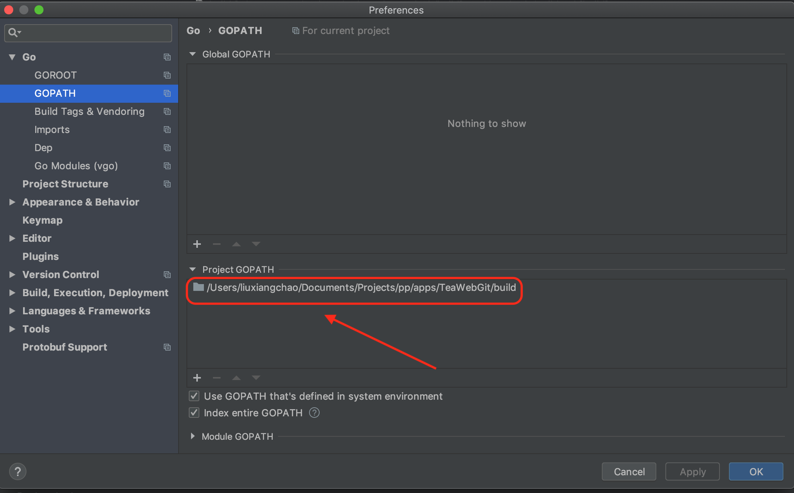

# 从源码启动或编译
要想从源码启动TeaWeb，或者从源码编译TeaWeb，需要有以下几个前提，缺一不可：
1. [安装Golang](#安装golang)
2. [安装Git](#安装git)

## 安装Golang
如果你还没有安装Golang运行环境，请先安装，Go的版本需要在 v1.10.0以上，国内可以从 [GO语言中文网](https://studygolang.com/dl) 下载并安装。

安装Go之后，需要确保`go`命令在系统的`PATH`环境变量中，可以通过以下命令测试Go是否可用：
~~~bash
go version
~~~

## 安装Git
运行环境必须有Git命令行环境，并需要确保`git`命令在系统的`PATH`环境变量中，可以通过以下命令测试Git是否可用：
~~~bash
git --version
~~~

如果还没有安装Git，可以从[这里](https://git-scm.com/downloads)下载你的操作系统对应的版本。安装后可能需要重新打开你的终端或命令行工具才会生效。

## 从源码运行
1. 从 `https://github.com/TeaWeb/build` 中下载项目源码，放到本地磁盘上；
2. 在开发工具中设置全局变量`GOPATH`为项目目录路径；
3. `cd` 到 *src/main* 目录
4. 执行 `init.sh` （Windows上是`init.bat`）初始化项目，如果下载中出现网络错误，可以尝试多次运行此脚本；
5. 执行 `run.sh` （Windows上是`run.bat`） 启动项目；
6. 在浏览器中访问 `http://127.0.0.1:7777` 。

## 从源码编译
1. 从 *https://github.com/TeaWeb/build* 中下载项目源码，放到本地磁盘上；
2. 在开发工具中设置全局变量`GOPATH`为项目目录路径；
3. `cd` 到 *src/main* 目录
4. 执行 `init.sh` （Windows上是`init.bat`）初始化项目，如果下载中出现网络错误，可以尝试多次运行此脚本；
5. 运行 `build-[系统版本].sh` 构建可执行文件，Windows上交叉编译环境配置比较复杂，建议在Linux或Mac上进行；
6. 构建后的文件在 `项目根目录/dist/` 目录下。

## 使用Git下载源码
如果你想使用Git下载源码，可以使用下面命令： 
~~~bash
git clone https://github.com/TeaWeb/build.git
~~~
然后再运行`init.sh`（在Windows上使用`init.bat`）：
~~~bash
./init.sh
~~~

## GoLand
如果你正在使用GoLand开发工具，则可以在下面的界面中设置GOPATH:

其中画红框的部分为你的本地的项目根目录，在`src`目录的上一级。

## 寻求帮助
遇到了问题？可以在[这里](http://teaos.cn/community)找到社区的联系方式，加入社区在线咨询。