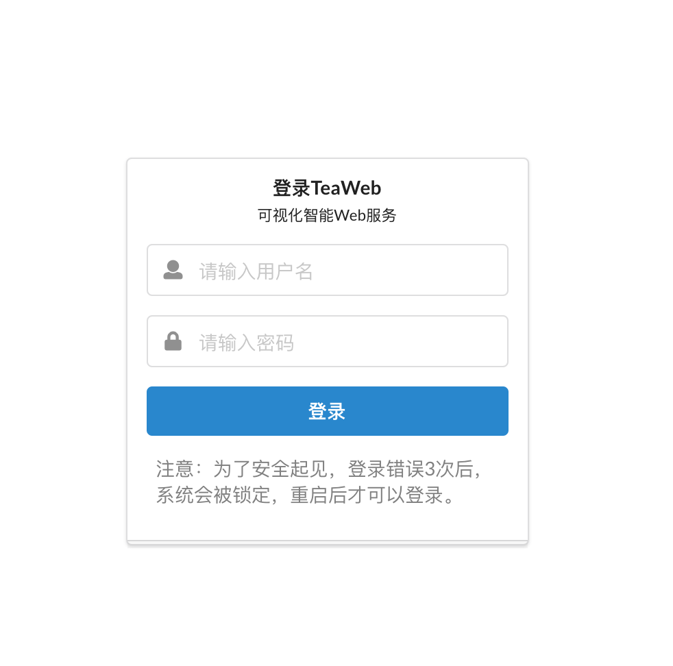

# 登录
安装成功后，在浏览器上（推荐Chrome、Firefox或IE10以上版本）访问服务地址（通常是 `http://IP地址:7777` ，但可以在"设置"功能中修改），即可显示登录界面：

如果你是第一次登录，用户名是admin，密码是123456，可以登录后在顶部菜单 > "设置 > 登录设置"中修改。

如果连续3次输错用户名密码，系统会自动锁定，需要[重置服务状态](./Commands.md)后才能继续登录。