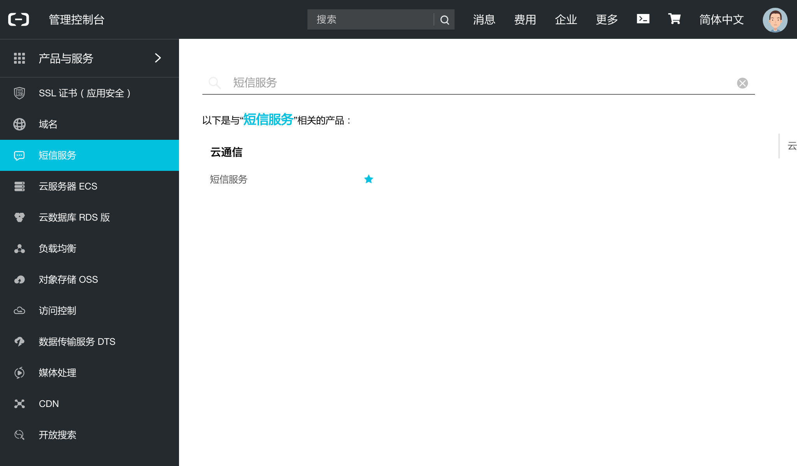
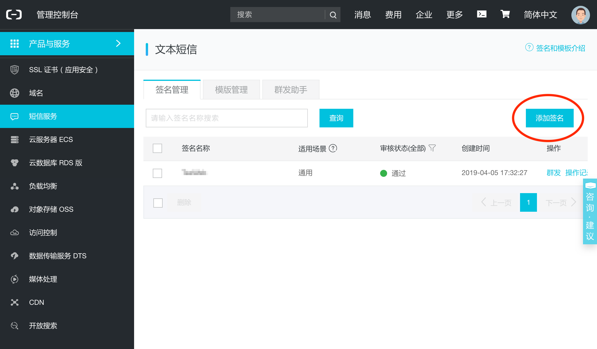
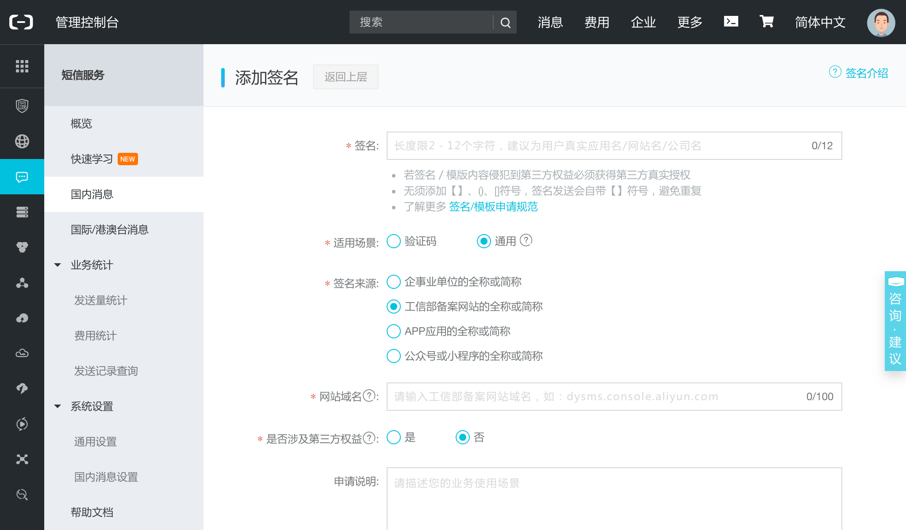
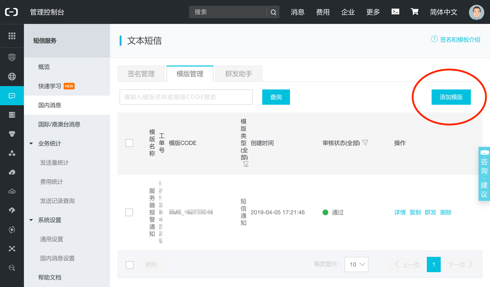
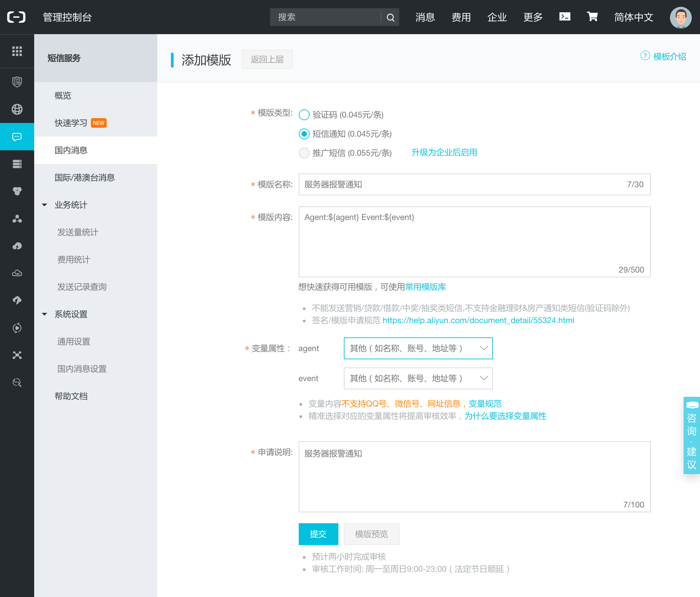
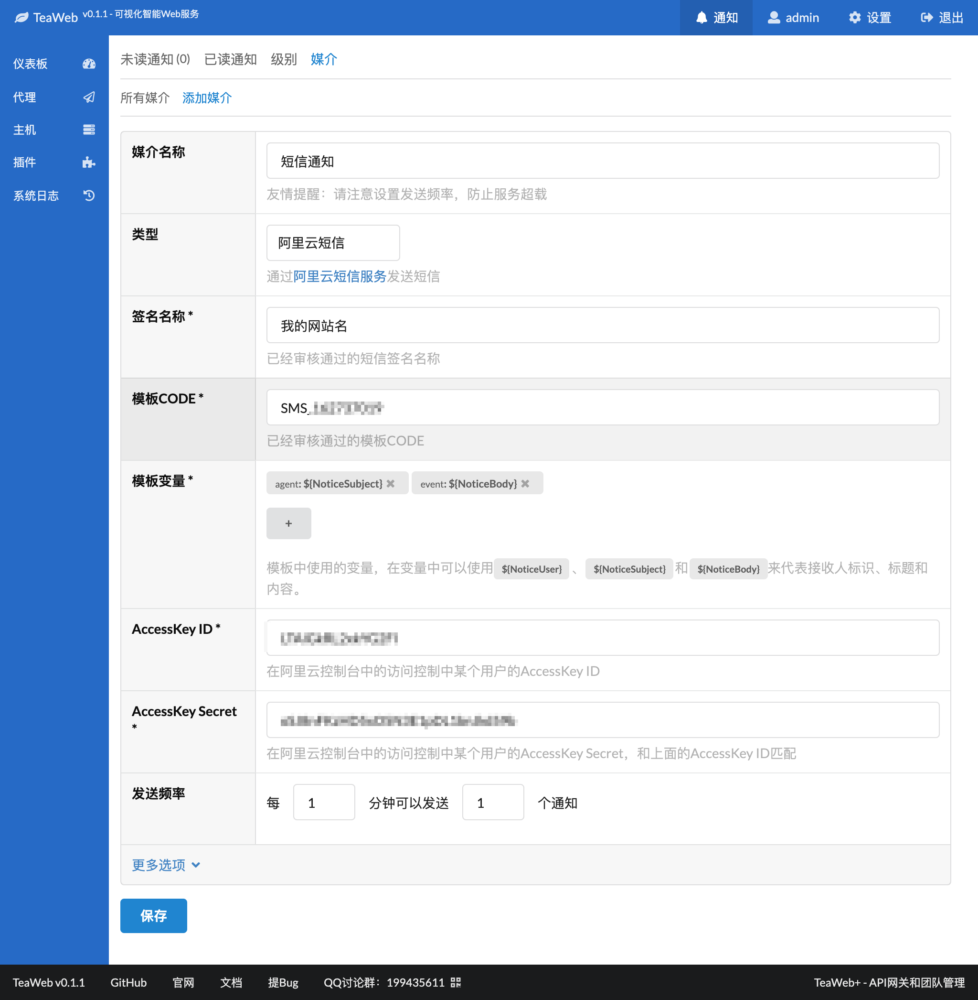
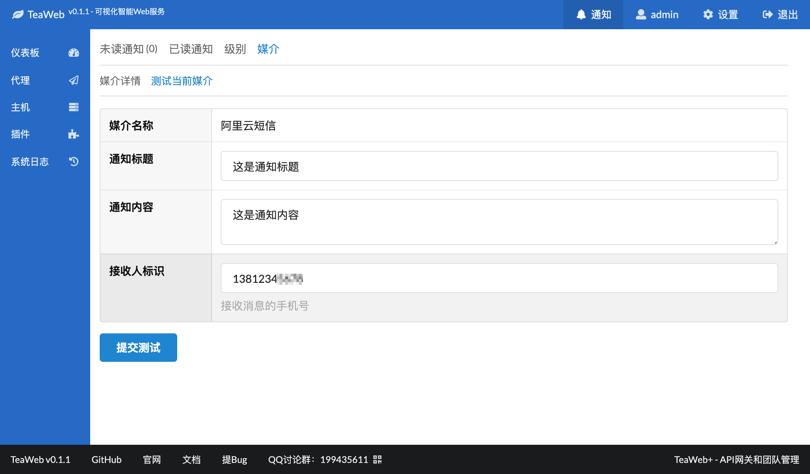
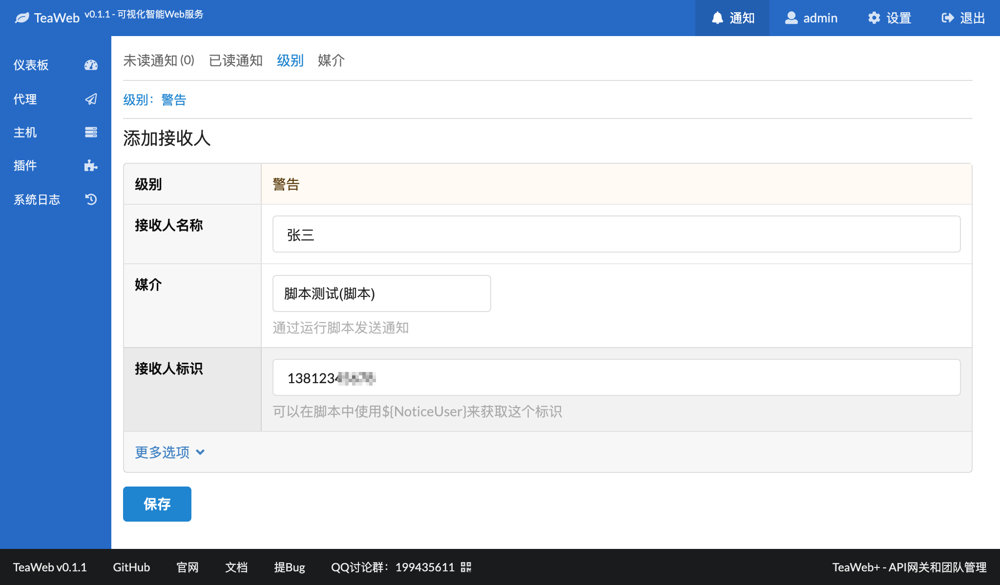

# 阿里云短信
从v0.1.1开始可以通过阿里云短信发送通知信息，步骤为：
1. [检查能否调用API](#检查能否调用api)
2. [登录阿里云控制台](#登录阿里云控制台)
3. [添加签名](#添加签名)
4. [添加模板](#添加模板)
5. [获取AccessKey](#获取accesskey)
6. [添加媒介](#添加媒介)
7. [测试媒介](#测试媒介)
8. [添加接收人](#添加接收人)

## 检查能否调用API
在服务器上通过：
~~~bash
telnet dysmsapi.aliyuncs.com 443
~~~
检查能否调用阿里云短信API，如果超时或连接被拒绝表示不能调用，可能要调整服务器防火墙设置。

当然你也要检查你的短信余量是否足够，还没有购买的可以[点此购买](https://www.aliyun.com/product/sms?spm=5176.11533447.1097531.2.12055cfa6UnIix)。

## 登录阿里云控制台
可以在[https://account.aliyun.com](https://account.aliyun.com)登录阿里云，登录后点击右上角的"[控制台](https://home.console.aliyun.com)"进入控制台。

然后通过菜单或者产品服务进入到短信服务中：

## 添加签名
如果你已经有通过审核的签名，可以忽略此步骤。

在国内短信中"签名管理"选项卡中：

点击"添加签名"，进入添加签名页面：

可以参考阿里云的帮助文字进行填写，"签名"项选择跟你的网站或App有关的名字，如果有网站的可以优先选择工信部备案网站的全称或简称，"适用场景"项选择"通用"，如果"签名来源"选择了网站，则网站域名输入顶级域名即可，比如"teaos.cn"，前面不要加www之类的二级域名；如果一个网站同时备案了多个域名，则填写主要的域名。

填写完整后，可以提交审核。

## 添加模板
如果你已经有通过审核的模板，可以忽略此步骤。

在国内短信中"模板管理"选项卡中：

点击"添加模板"进入添加模板页面：

可以按照我填写的方式填写：
* `模板类型` - 选择"短信通知"
* `模板名称` - 输入"服务器报警通知"
* `模板内容` - 输入"Agent:${agent} Event:${event}"
* `变量属性` - 两个变量都选择"其他（如名称、账号、地址等）"
* `申请说明` - 写成服务器报警通知

然后提交审核。

## 获取AccessKey
在阿里云控制台的"访问控制"里"用户"菜单里可以添加一个用户即可获取一个AccessKey，下载CSV或将AccessKey的ID和Secret记录下来，以便下面使用。

## 添加媒介
在添加媒介中选择类型”阿里云短信”，然后输入相关信息：

这里要注意的是：
* `签名名称` - 你审核通过的[签名名称](#添加签名)；
* `模板CODE` - 你审核通过的[模板Code](#添加模板)，在审核通过的模板列表中会有这个Code；
* `模板变量` - 因为我们上面申请模板时填写了两个变量`${agent}`和`${event}`，所以我们可以在这里设置这两个变量的值，分别为`${NoticeSubject}`和`${NoticeBody}`，当然你可以设置成别的内容，甚至可以将`${NoticeSubject}`和`${NoticeBody}`颠倒过来都可以，因为他们只是变量，发通知时会被自动替换掉；同样的，如果你申请的短信模板中包含的是别的变量，也同样可以在变量内容中插入`${NoticeSubject}`和`${NoticeBody}`；
* `AccessKey ID`和`AccessKey Secret` - [填写获取的AccessKey的ID和Secret](#获取accesskey)。

以上填写完整后点击"保存"即可添加成功。

## 测试媒介
可以在具体的媒介详情中测试刚才添加的媒介：

## 添加接收人
在”级别”中可以添加各个通知级别对应的接收人：
