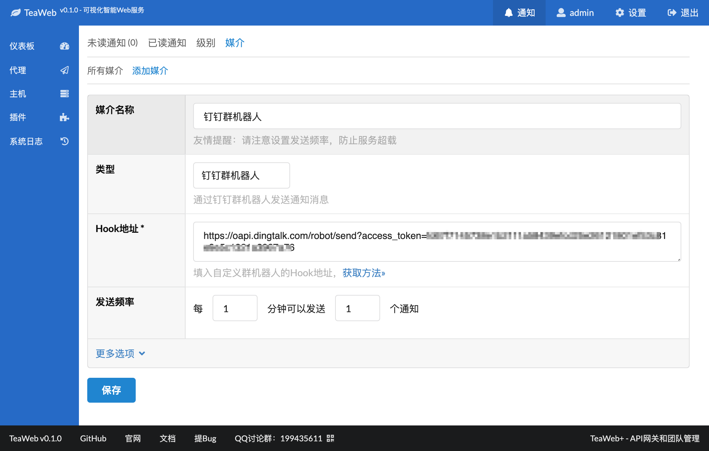
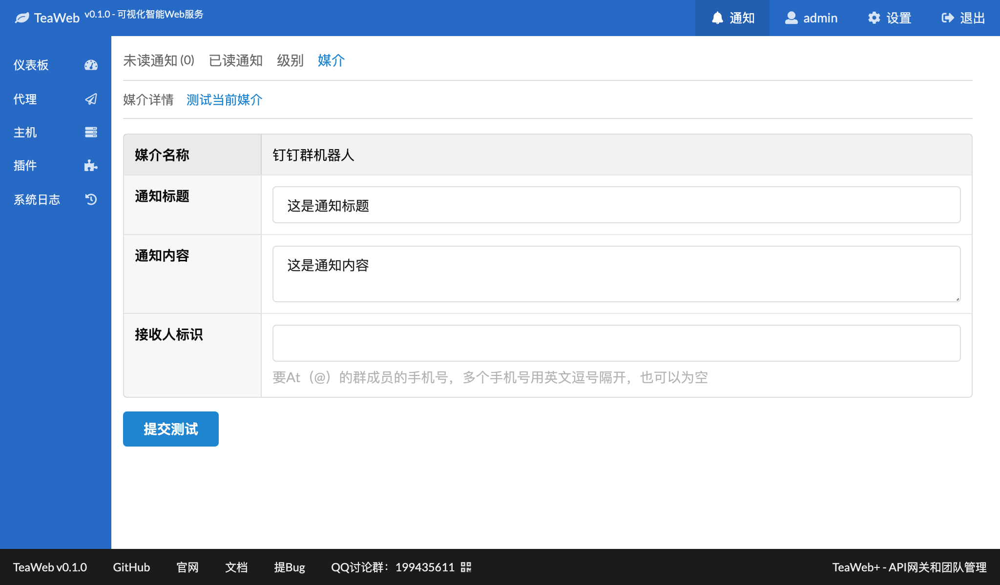
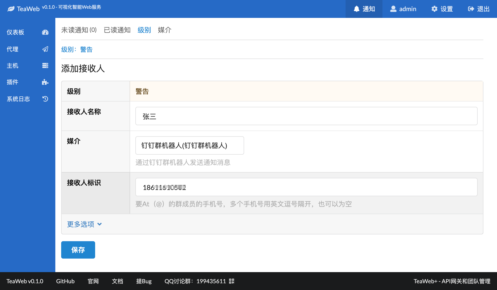

# 钉钉群机器人
从v0.1开始可以通过钉钉群机器人发送通知信息，步骤为：
1. [创建群机器人](#创建群机器人)
2. [获取自定义机器人webhook](#获取webhook)
3. [添加媒介](#添加媒介)
4. [测试媒介](#测试媒介)
5. [添加接收人](#添加接收人)

## 创建群机器人
[点这里查看钉钉官方相关文档](https://open-doc.dingtalk.com/microapp/serverapi2/nr29om#a-nameghfcskapc%E5%AE%A2%E6%88%B7%E7%AB%AF%E9%85%8D%E7%BD%AE%E5%85%A5%E5%8F%A3)。

## 获取webhook
[点这里查看钉钉官方相关文档](https://open-doc.dingtalk.com/microapp/serverapi2/qf2nxq)。

注意：只有在钉钉PC端才能查看webhook。

## 添加媒介
在添加媒介中选择类型”钉钉群机器人”，然后输入相关信息：

## 测试媒介
进入"钉钉群机器人"媒介详情，在"测试当前媒介"中可以测试此媒介：

## 添加接收人
在"级别"中可以添加各个通知级别对应的接收人：

其中接收人标识可以是一个或者多个已经在群里的成员的手机号，也可以为空，同样也能接收到通知，只不过不会添加At（@）而已。