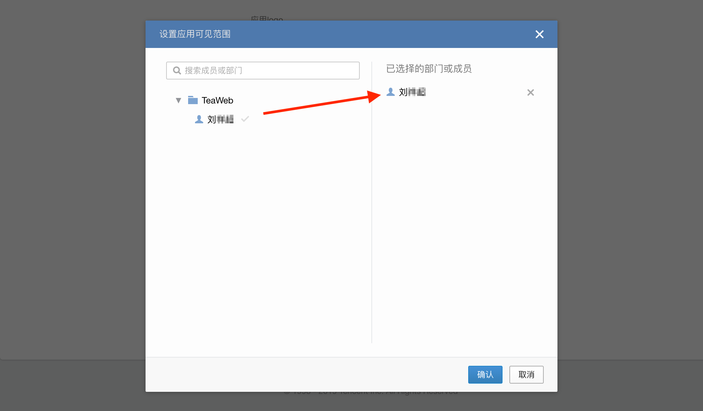
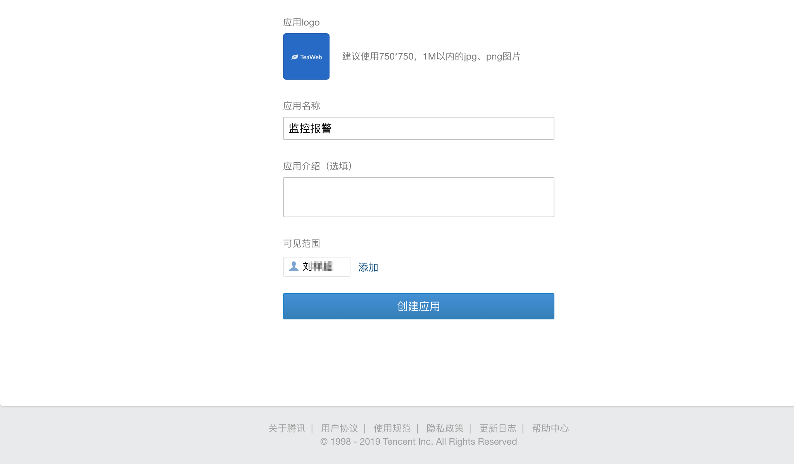
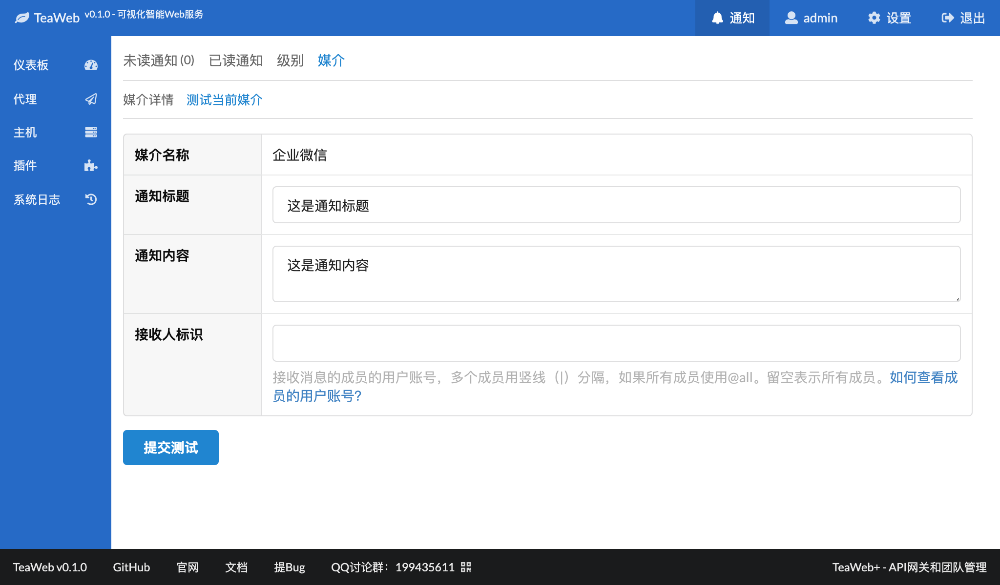
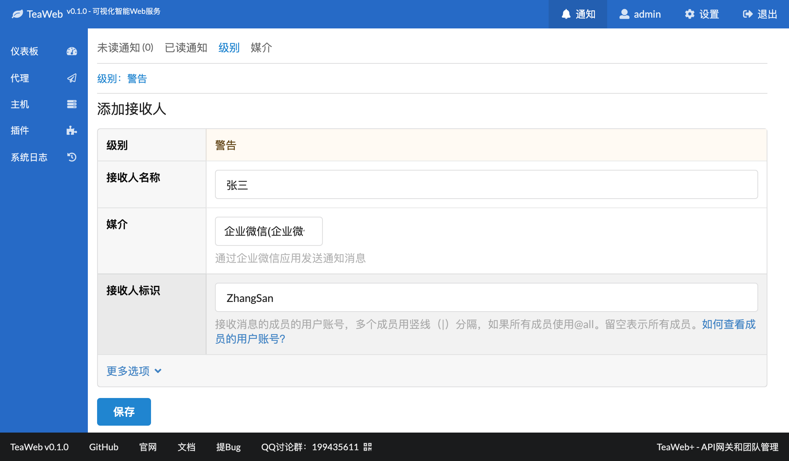
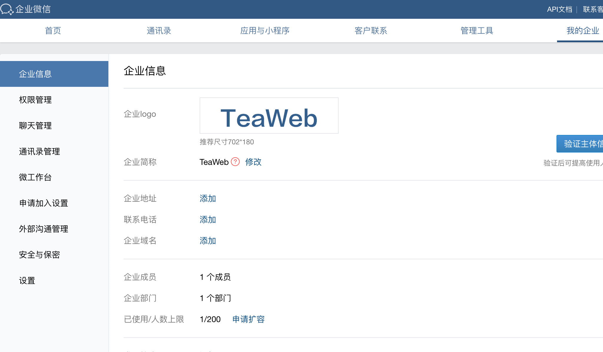
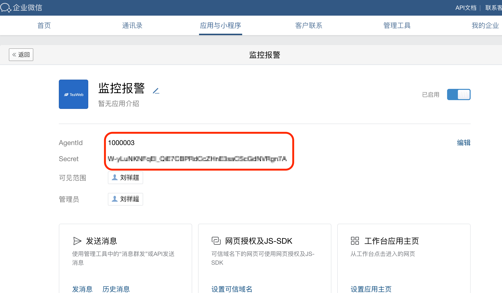
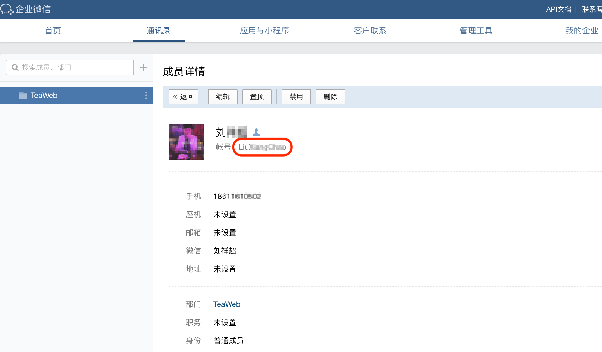
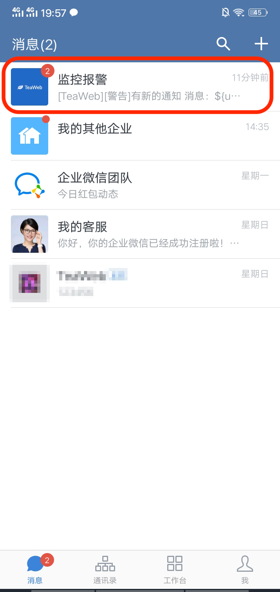

# 企业微信媒介
从v0.1开始可以通过企业微信发送通知信息，步骤为：
1. [创建应用](#创建应用)
2. [添加媒介](#添加媒介)
3. [测试媒介](#测试媒介)
4. [添加接收人](#添加接收人)

## 创建应用
选择顶部菜单的"应用与小程序"，进入应用与小程序页面：

点击"创建应用"，进入创建应用界面：

需要上传一个应用Logo。然后写入一个应用名称，比如叫"监控报警"：

然后点击"选择部门/成员"，弹出选择部门和成员窗口：

选中要接收消息的成员，比如上图中的"刘**"，选择成功时，右侧"已选择的部门或成员"下会出现选中的成员。点击"确定"后回到创建应用页面：

点击上图中的"创建应用"页面，创建应用成功。

## 添加媒介
在添加媒介中选择类型"企业微信"，然后输入相关信息：

其中：
* [企业ID](#企业id)
* [AgentId](#agentid)
* [App Secret](#appsecret)

点击页面底部的"保存"即可完成企业微信媒介的创建。

## 测试媒介
进入"企业微信"媒介详情，在"测试当前媒介"中可以测试此媒介：

## 添加接收人
在"级别"中可以添加各个通知级别对应的接收人：

其中"接收人标识"，是接收消息的成员的用户账号，多个成员用竖线（|）分隔，如果所有成员使用@all。留空表示所有成员。可以在[这里](#用户账号)看如何查看用户账号。

## 相关参数
### 企业ID
进入[企业微信官网](https://work.weixin.qq.com/)，点击顶部菜单中的"我的企业"：

在这个页面的下方有一个"企业ID"：

### AgentId
进入[企业微信官网](https://work.weixin.qq.com/)，点击顶部菜单中的"应用与小程序"，选择[创建的应用](#创建应用)，在应用详情中红色框中的部分：

### App Secret
进入[企业微信官网](https://work.weixin.qq.com/)，点击顶部菜单中的"应用与小程序"，选择[创建的应用](#创建应用)，在应用详情中红色框中的部分：

### 用户账号
进入[企业微信官网](https://work.weixin.qq.com/)，点击顶部菜单的"通讯录"，然后在通讯录中点击一个成员可以进入到成员详情：

图中红框的部分即为成员的用户账号。

## 收到通知的效果

