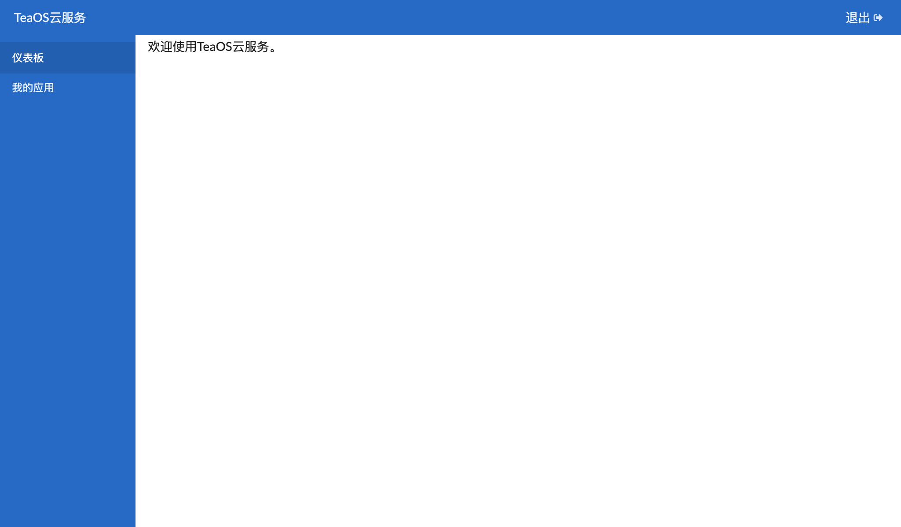
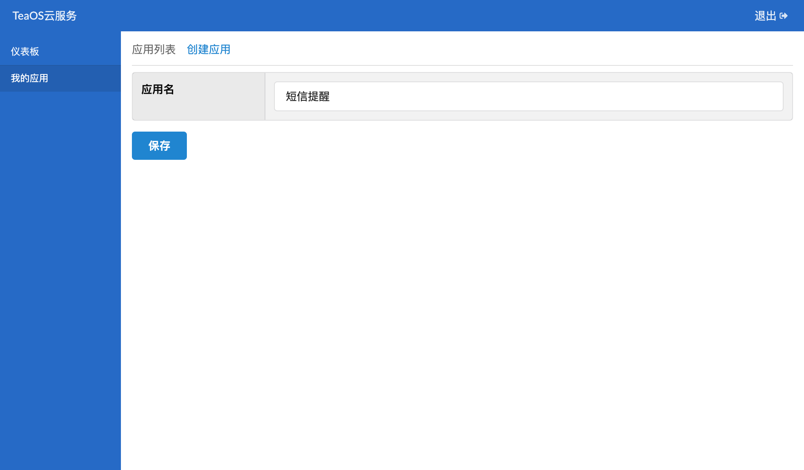
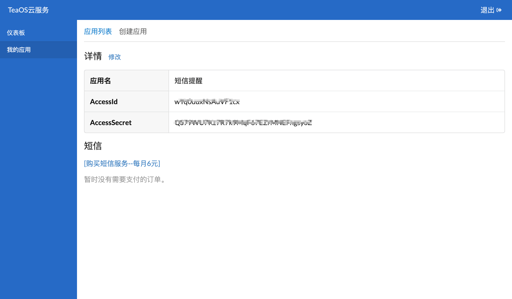
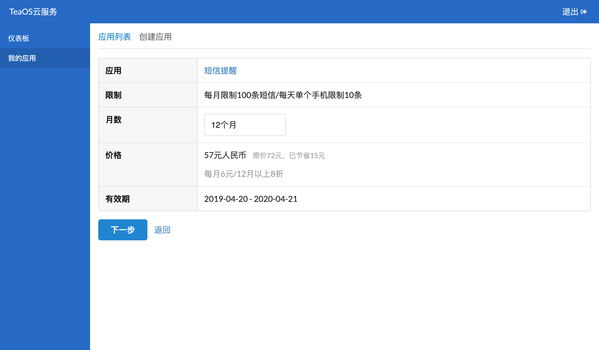
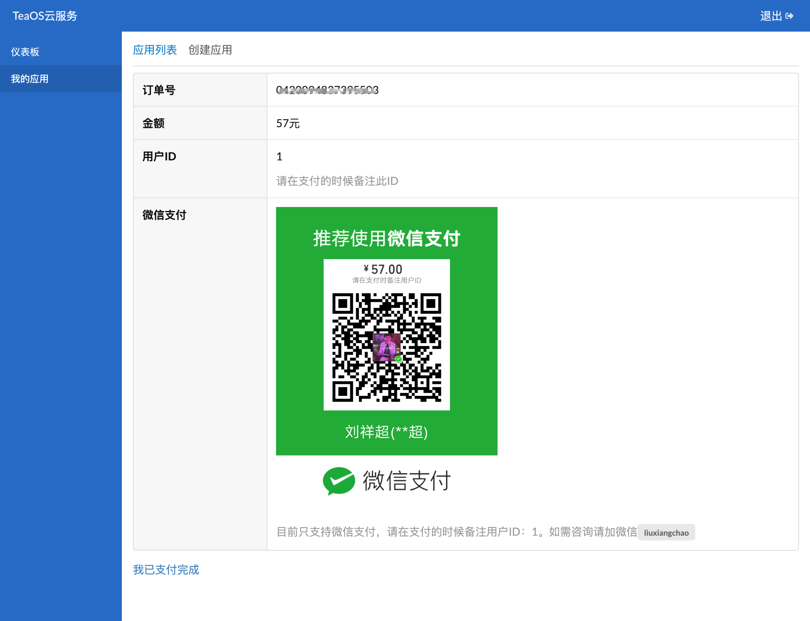
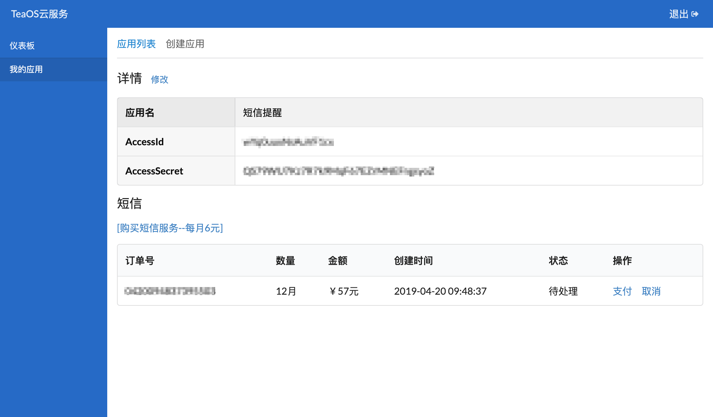
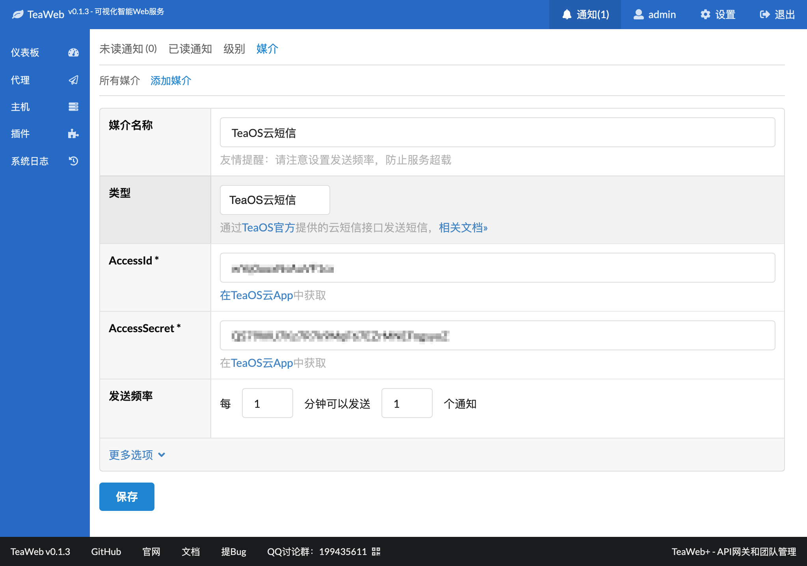
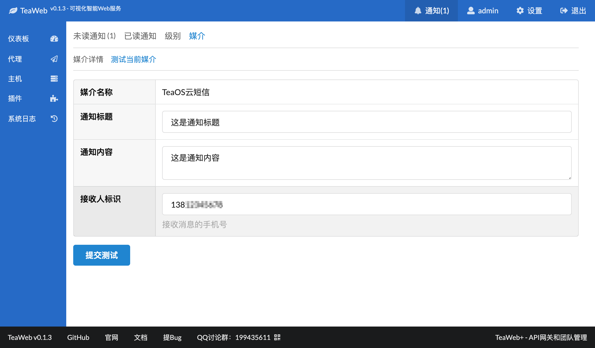
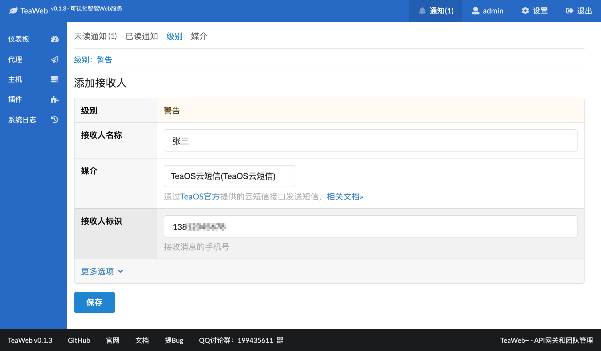

# TeaOS云短信
从v0.1.2开始，为了让TeaWeb用户可以很简单地就能使用短信通知，我们在通知媒介中添加了TeaOS云短信，仅需每月6元，使用步骤为：
1. [登录TeaOS云](#登录teaos云)
2. [创建应用](#创建应用)
3. [购买服务](#购买服务)
4. [添加媒介](#添加媒介)
5. [测试媒介](#测试媒介)
6. [添加接收人](#添加接收人)

## 登录TeaOS云
在[这里](http://cloud.teaos.cn)登录[TeaOS云](http://cloud.teaos.cn)，如果还没有账号，可以点击界面上的注册新账号注册一个新的账号，然后再登录TeaOS云。

登录后的界面：

## 创建应用
在上面的界面中点击"我的应用"，然后点击右侧菜单中的"创建应用"：

填入一个应用名，比如"短信提醒"，点击"保存"后进入应用详情页：

## 购买服务
创建应用后，点击应用详情中的"购买短信服务--每月6元":

点击"下一步"进入：

使用微信扫码进行支付，支付完毕后点击底部的"我已支付完成"等待处理：

## 添加媒介
在"通知" -- "媒介"中的"添加媒介"页面选择"TeaOS云短信"，填入我们创建的应用的AccessId和AccessSecret：

点击页面底部的"保存"即可完成TeaOS云短信媒介的创建。

## 测试媒介
进入"TeaOS云短信"媒介详情，在"测试当前媒介"中可以测试此媒介：

## 添加接收人
在"级别"中可以添加各个通知级别对应的接收人：

