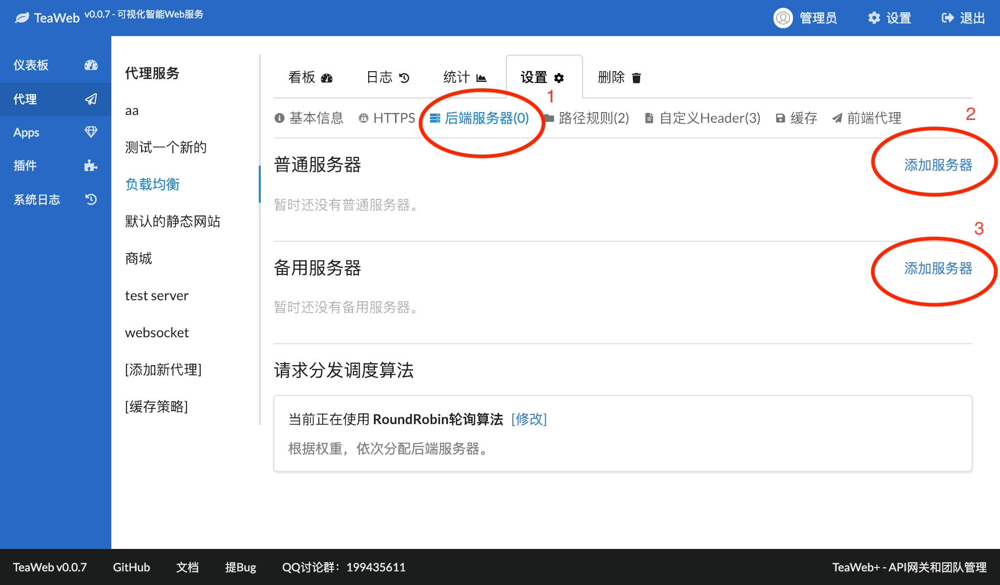
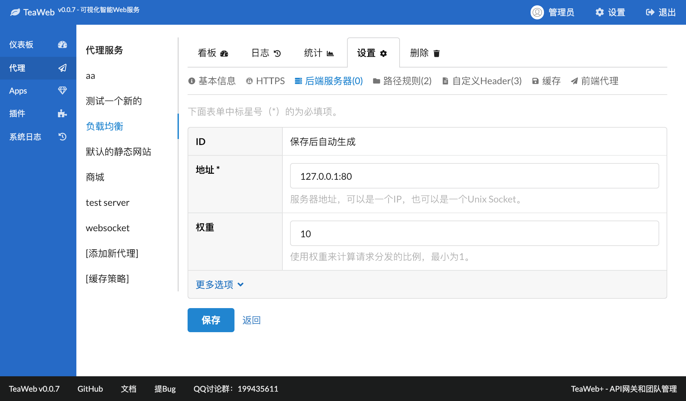
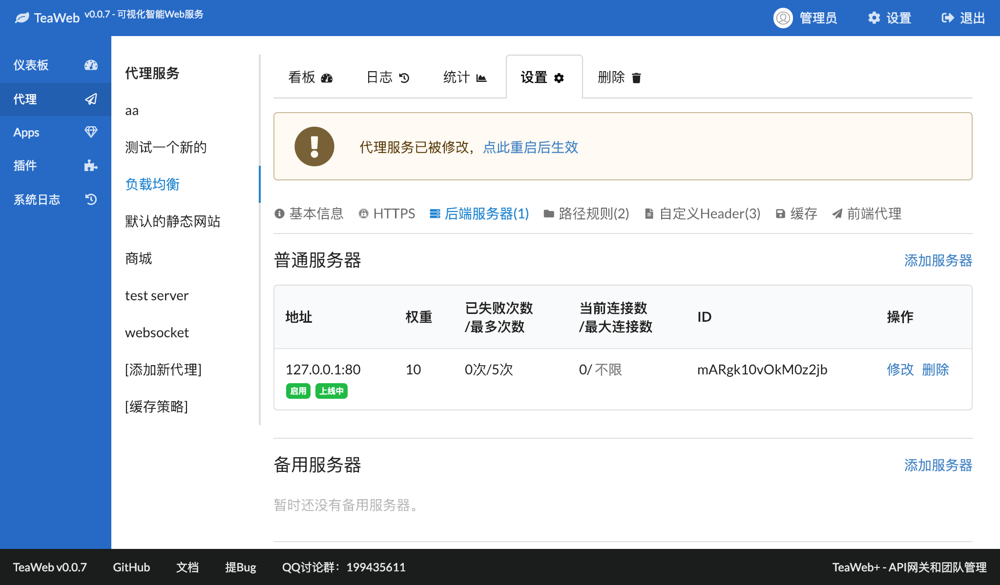
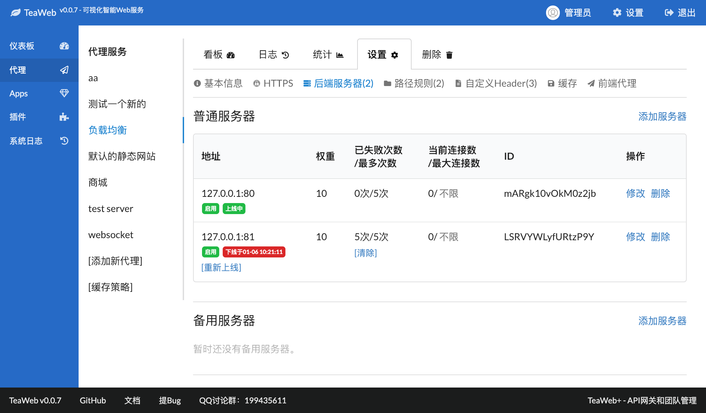

# 后端服务器
可以为代理服务、[Websocket](Websocket.md)设置一组后端服务器，当代理服务接收到请求时，会根据[请求分发调度算法](#请求分发调度算法)自动分发到这些后端服务器上。

## 添加后端服务器
这里讲解如何为代理服务添加一组后端服务器。

打开代理服务设置点击"后端服务器"，进入后端服务器列表：

上图中链接2是添加普通的后端服务器，链接3是添加备用的后端服务器。当普通的后端服务器没有设置或者全部不可用时，会自动启用备用服务器。

点击上图链接2进入添加后端服务器界面：

输入后端服务器的地址，权重默认为10，通常不需要修改，也可以展开"更多选项"，设置连接失败超时、连接最多失败次数、最大并发连接数等参数。

点击"保存"后返回后端服务器列表：

根据页面提示点击重启后生效。

## 自动下线
如果一个后端服务器错误连接次数超过自己设置的"连接最多失败次数"，则会自动下线，比如下面的"127.0.0.1:81"服务器：

在修复你的后端服务器故障后，可以点击"重新上线"，让这个后端服务器可以重新接受分发的请求。

## 请求分发调度算法
TeaWeb目前提供四种调度算法，可以根据你的需求进行选择：
* Random随机算法：根据权重设置随机分配后端服务器
* RoundRobin轮询算法：根据权重，依次分配后端服务器
* Hash算法：根据自定义的键值的Hash值分配后端服务器，这些自定的键值可以由一些自定义变量组成，比如用户的IP（`${remoteAddr}`）或者请求的URL（`${host}${requestURI}`）等等。
* Sticky算法：利用Cookie、URL参数或者HTTP Header来指定后端服务器