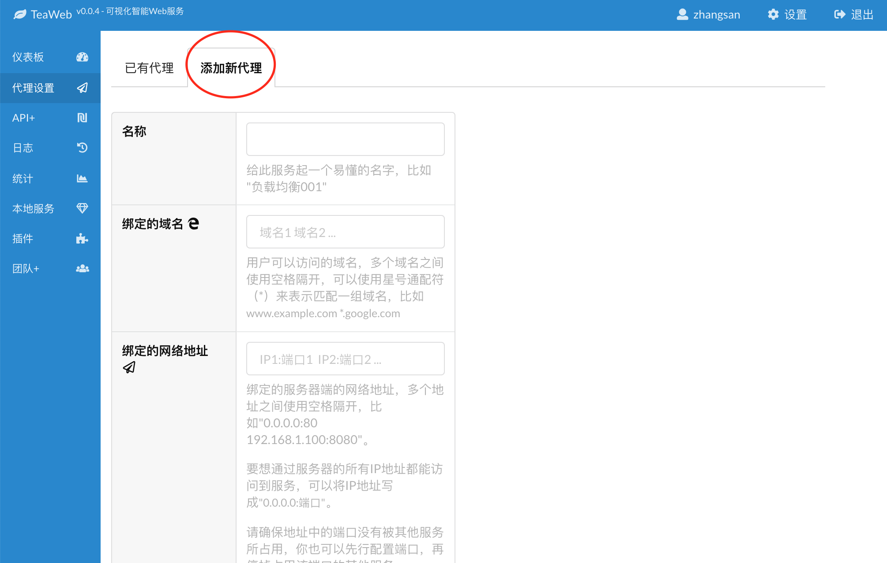

# 添加代理
在左侧菜单中点击"添加新代理"：

出现以下界面：

其中的选项：
* **名称** ：给此服务起一个易懂的名字，比如 "负载均衡001"，或者"代理服务001"，给服务一个编号是一个好的习惯；
* **绑定的域名**：用户在浏览器上可以访问的域名，如果有多个域名，则多个域名之间使用空格隔开，可以使用星号通配符（*）来表示匹配一组域名，比如www.example.com *.google.com；
* **绑定的网络地址**：绑定的服务器端的网络地址，多个地址之间使用空格隔开，比如"0.0.0.0:80 192.168.1.100:8080"；
  * 要想通过服务器的所有IP地址都能访问到服务，可以将IP地址写成"0.0.0.0:端口"；
  * 请确保地址中的端口没有被其他服务所占用，你也可以先行配置端口，再停掉占用该端口的其他服务；
  * 如果想配置HTTPS访问地址，可以先配置一个普通的服务，然后保存后再在代理服务详情中修改，具体参看[HTTPS](HTTPS.md)。
* **服务类型** ，服务类型分为两种：
  * 代理服务：通过TeaWeb将用户请求转发到一个或一组后端服务器中，通常可以实现负载均衡和反向代理服务；
  * 普通的Web服务：通过TeaWeb分发服务上的静态文件，之后也可以通过配置路径规则来实现动态内容的分发，比如Fastcgi。
* **后端服务器地址**  ：如果"服务类型"选择了代理服务，则会出现"后端服务器地址"输入框，这里填写实际提供服务的后端服务器地址，多个地址之间使用空格隔开，比如"192.168.1.100:8080 192.168.1.101:8080"；
* **网站根目录** ：如果"服务类型"选择了"普通的Web服务"，则会出现"网站根目录"输入框，这里填写相对于服务器文件系统的根目录的绝对路径，比如你的静态文件的文件目录结构为： 
  ~~~
  /home/www/mysite/
     index.html
     images/
       logo.png
  ~~~
  那么请输入 */home/www/mysite* ，然后添加后就可以通过 "http://服务地址/index.html"，"http://服务地址/images/logo.png" 来访问这些静态文件了。

所有项目填完后，可以点击"确定添加"即可完成；添加完毕后，系统会提示"代理服务已被修改，点此重启后生效"，点击重启后就可以在浏览器上试着访问绑定的域名或者绑定的网络地址了。