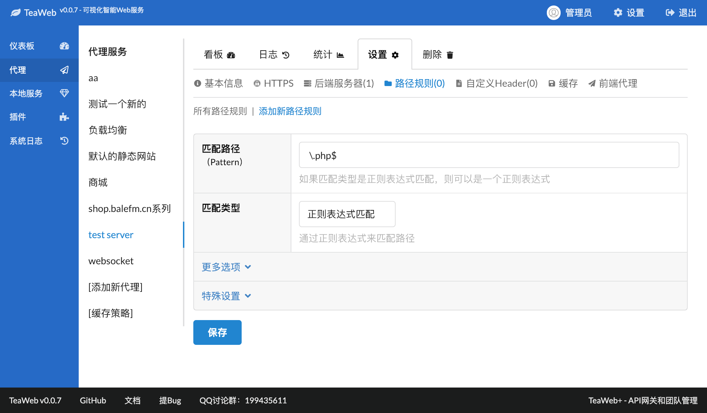
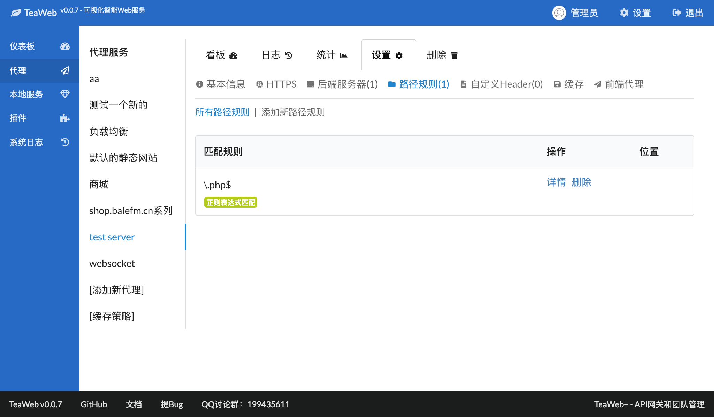
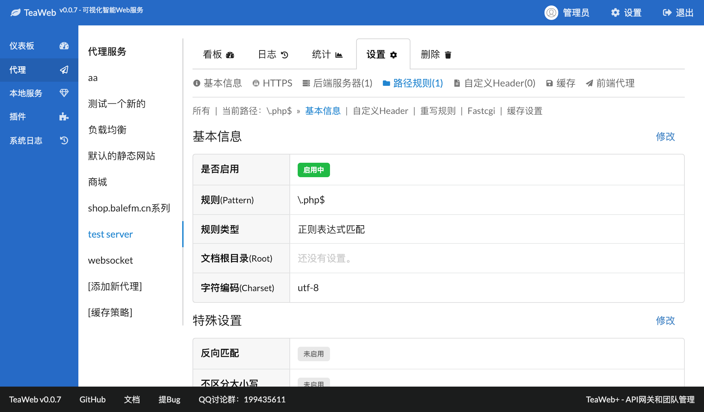
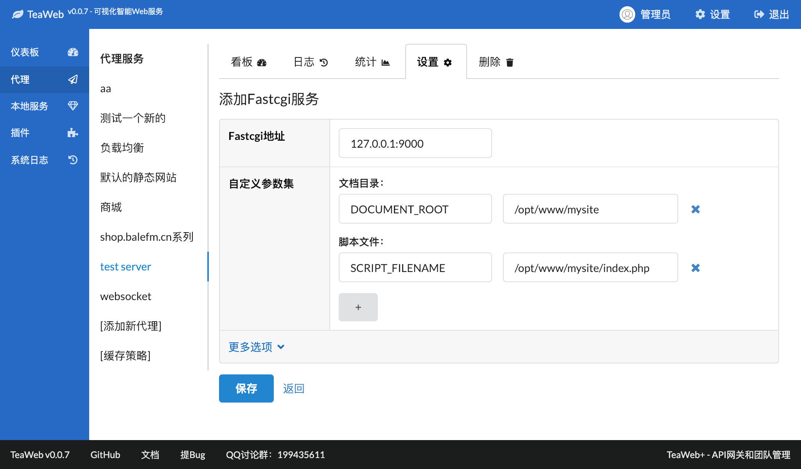
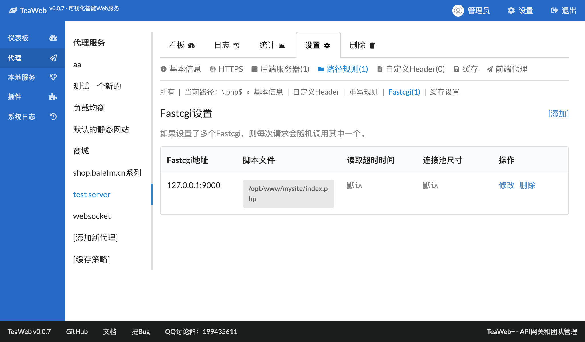

# Fastcgi
可以使用TeaWeb直接将请求分发到后端的Fastcgi。

## 步骤1 - 添加路径规则
比如我们的Fastcgi分发的是PHP文件（像php-fpm），通常扩展名都是 *.php* ，那么可以在"路径规则"中添加一条规则：`\.php$`。

1. 点击"路径规则"下的"添加新路径规则"，输入相关信息：

其中"匹配路径"是一个正则表达式，表示匹配所有含有".php"结尾的路径，反斜杠是正则表达式中的转义字符，表示其中的点（.）是一个普通的点符号。
其中"匹配类型"选择"正则表达式匹配"。

2. 点击底部的保存按钮，保存。保存后跳转到路径规则列表：

## 步骤2 - 添加Fastcgi配置
3. 点击上图中的路径规则列表中的"\.php$"的"详情"：

4. 点击"Fastcgi"菜单：

5. 点击"[添加]"链接，然后填入以下信息：

其中 *Fastcgi地址* 是Fastcgi的端口地址，如果你是使用unix socket启动，可以填入unix socket的绝对路径；*SCRIPT_FILENAME* 是接收请求的入口文件，通常是一个脚本，比如PHP文件；*DOCUMENT_ROOT* 是脚本所在的根目录。在这里还可以添加更多的Fastcgi参数。
自定义参数中支持一些变量，可以参考[参数变量](#参数变量)。

6. 点击底部的"保存"按钮，保存，跳转后的页面为：

7. 根据顶部的提示，重启后即可生效，现在可以试试再浏览器访问试试。

## 设置首页文件
如果不想在首页输入 *index.php* 这样的路径，则可以在代理服务的"基本信息"中设置"首页文件"，加入：
~~~
index.html index.php
~~~

## 分发静态内容
如果网站有静态内容需要分发，可以在代理服务的"基本信息"中设置"文档根目录"。

## 参数变量
自定义参数集中的参数值部分支持一些变量：
* `${fastcgi.documentRoot}` - 参数`DOCUMENT_ROOT`的值，v0.0.10开始支持
* `${fastcgi.filename}` - URL中匹配的文件名，v0.0.10开始支持
* `${fastcgi.pathInfo}` - 通过`PATH_INFO匹配`选项匹配出来的PATH_INFO变量，v0.0.10开始支持
* 支持所有的[请求相关变量](http://teaos.cn/doc/proxy/Variables.md#%E8%AF%B7%E6%B1%82%E7%9B%B8%E5%85%B3%E5%8F%98%E9%87%8F)，v0.0.10开始支持
