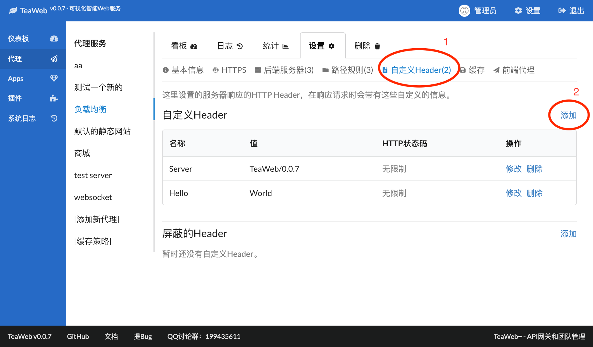
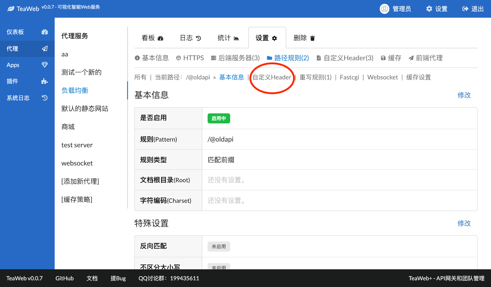
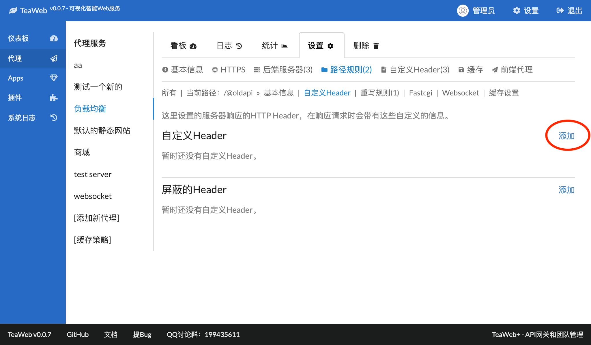
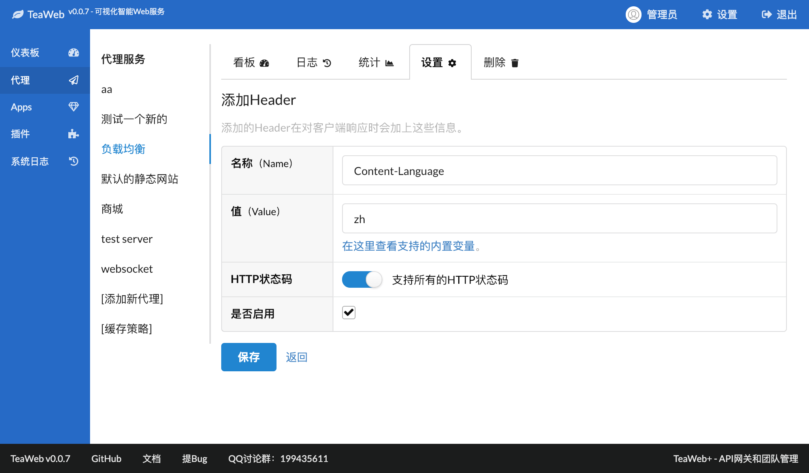

# 自定义Header
可以在TeaWeb中设置一组HTTP Header，在对客户端进行响应时，加上这些Header：
~~~http
HTTP/1.1 500 Internal Server Error
Hello: World
Server: TeaWeb/0.0.7
~~~
上面的`Hello`和`Server`就是我们设置的自定义Header。

## 添加自定义Header
可以在代理服务设置中为代理服务全局添加自定义Header，也可以为某个[路径规则](Location.md)添加自定义Header。

### 全局自定义Header
在代理服务设置中点击"自定义Header"菜单（下图中的1链接）：

点击"添加"（上图中的2链接）进入添加自定义Header页面：

填入名称和值，其中值是支持[内置变量](Variables.md)的。

然后点击"保存"按钮后即可返回自定义Header列表，按照页面提示点击重启后生效。

### 路径规则自定义Header
在代理服务设置中点击"路径规则"：

选择要添加自定义Header的路径规则的"详情"：

点击上图中的"自定义Header"，打开自定义Header列表：

点击上图中的"添加"进入添加自定义Header页面：

填入名称和值，其中值是支持[内置变量](Variables.md)的。

然后点击"保存"按钮后即可返回自定义Header列表，按照页面提示点击重启后生效。

## 屏蔽Header
跟添加自定义Header一样，同样可以添加要屏蔽输出的HTTP Header，添加方式同添加自定义Header大体一致。