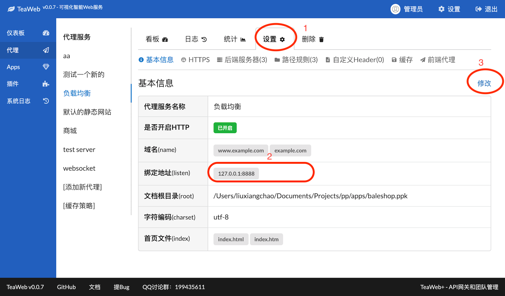
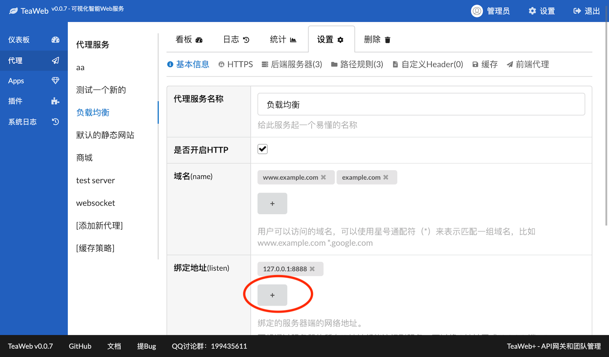

# 绑定网络地址
用户访问代理服务的时候，必须通过一个域名或者一个IP地址+端口（默认为80或443），如果是域名的话也会自动转换为IP地址+端口的形式，所以必须在代理上绑定此地址，用户才能访问：
~~~
用户  <--> 浏览器  <--> 域名 <--> 代理IP地址:端口
~~~

可以在代理服务设置（下图中1）基本信息中设置绑定的网络地址：

点击修改（上图中的3），可进入包含域名修改在内的基本信息修改页面：

点击上图的"+"（加号），可以添加一个新的网络地址，网络地址支持以下两种：
* 只有端口：`:8080` 或 `8080`
* 完整地址：`192.168.1.100:8080`

如果要支持所有的IP都能访问此代理服务，可以把地址的IP部分写成`0.0.0.0`，比如`0.0.0.0:80`。

注意这个网络地址和后端服务器的地址没有任何关系，不要将两者搞混了。