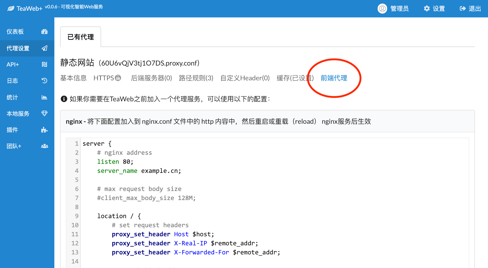

# Nginx
如果你需要在`TeaWeb`前面需要加一个`nginx`代理，类似于以下结构：
~~~
[用户] <--> [nginx] <--> [TeaWeb] <--> Backends
~~~
可以代理服务设置中的"前端代理"中查看自动生成的`nginx`配置：

然后将配置加入到`nginx`的`nginx.conf`中：
~~~nginx
http {
    ...
    
    server {
        # nginx address
        listen 80;
        server_name example.cn;
        ...
    }
}
~~~
可以根据自己的需要修改上面配置中的`listen`（`nginx`监听地址）和`server_name`（供用户访问的域名）。

## 使用include指令
也可以将配置文件保存成 `xxx.conf`（将`xxx`改成一个有意义的文件名，英文字母和数字的组合），然后在`nginx.conf`中配置：
~~~nginx
http {
    ...
    
    include /这里是绝对路径/xxx.conf;
}
~~~

## 重载nginx配置
如果要想`nginx`配置生效，需要重载或者重启`nginx`。

### 重载
~~~bash
sbin/nginx -t  # 检查nginx配置是否正确
sbin/nginx -s reload
~~~

### 重启
~~~bash
sbin/nginx -t  # 检查nginx配置是否正确
sbin/nginx -s stop # 停止nginx
sbin/nginx # 启动nginx
~~~
