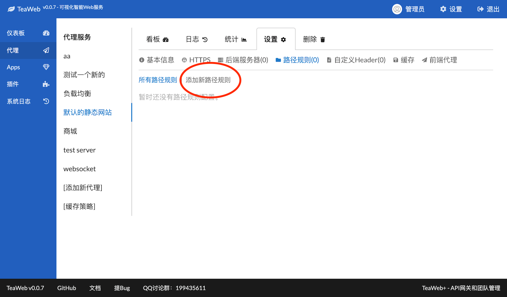
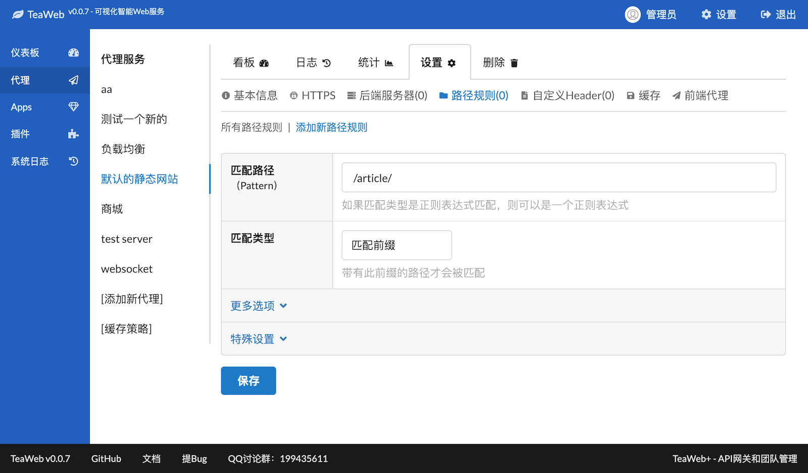
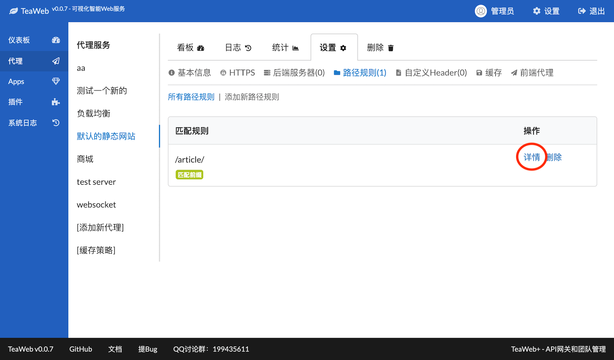
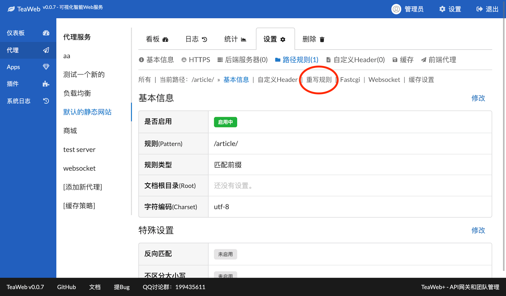
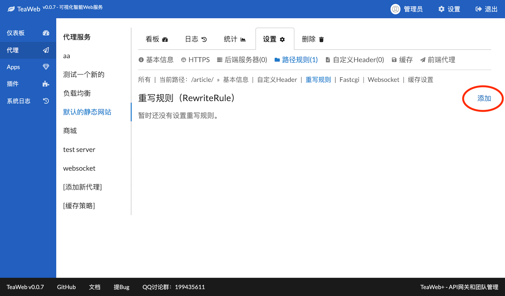
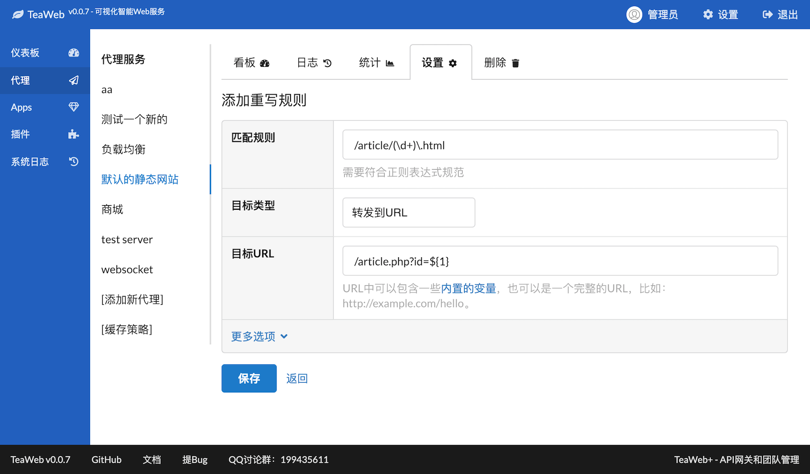
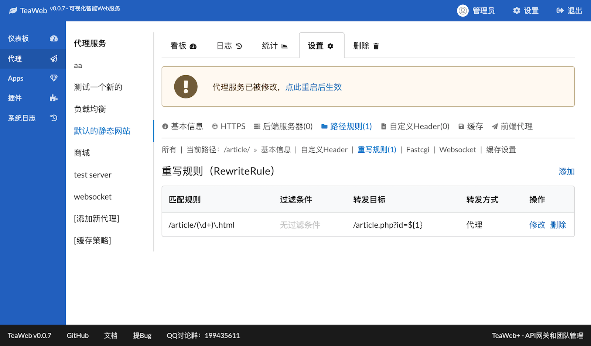

# 重写规则
重写规则也被熟知为RewriteRule，几乎在各个Web服务中均是常用的功能，TeaWeb也提供了较为完整的支持。

## 添加一个重写规则
我们现在就以以下需求作为示例，演示如何利用TeaWeb添加一个重写规则：
~~~
将 /article/123456.html 重写为 /article.php?id=123456
~~~
上面的`123456`只是一个演示，可能是任意一个数字。这个需求很常见，因为很多CMS都要把程序伪装成比较好看的URL。

## 步骤1 - 添加路径规则
1. 在"设置"下的"路径规则"页面中点击"添加新路径规则"：

2. 填入一个路径`/article/`，这里我们选`匹配前缀`，表示所有前缀为`/article/`的URL都会被匹配：

3. 点击底部的"保存"，跳转到路径规则列表：

## 步骤2 - 设置Rewrite
4. 点击上图中的"详情"，进入以下界面：

5. 点击上图中的"重写规则"，进入重写规则列表页面：

6. 点击上图的"添加"进入重写规则填写页面，并填写相关内容：

其中的`\d+`表示一个或多个数字，`${1}`表示正则表达式匹配的第一个括号里的内容，这里也可以使用别的变量，可以在[这里查看可以使用的变量](Variables.md)。

7. 点击上图中的"保存"，会返回重写规则列表页面：

点击顶部的"点击重启后生效"连接，可自动重启服务

8. 这时候就可以在浏览器上访问 `http://你的域名/article/123456.html` 了。

## 更多示例
### 将所有非teaos.cn的域名跳转到默认网站
下面演示如何将非"teaos.cn"的域名的访问跳转到默认网站：
1. 增加一个路径规则
   * 匹配路径：填入`/` 
   * 匹配类型：选择`匹配前缀`
   * 保存
2. 在刚才添加的路径规则中增加一个重写规则：
   * 匹配规则：填入`.*`
   * 目标类型：选择`转发到URL`
   * 目标URL：输入`http://teaos.cn`
   * 更多选项 -- 转发方式：选择`跳转`
   * 更多选项 -- 匹配条件：
      * 参数：填入`${host}`，表示参数值是用户访问的域名
      * 运算符：选择`正则表达式不匹配`
      * 对比值：`teaos\.cn`
   * 保存     

经过此配置后，用户所有非teaos.cn的域名都会自动跳转到`http://teaos.cn`上。    

当然在实际应用中，你需要将`teaos.cn`修改成你自己的域名。                