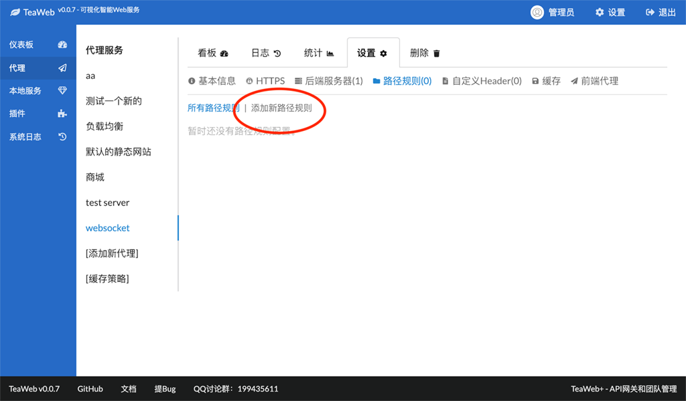
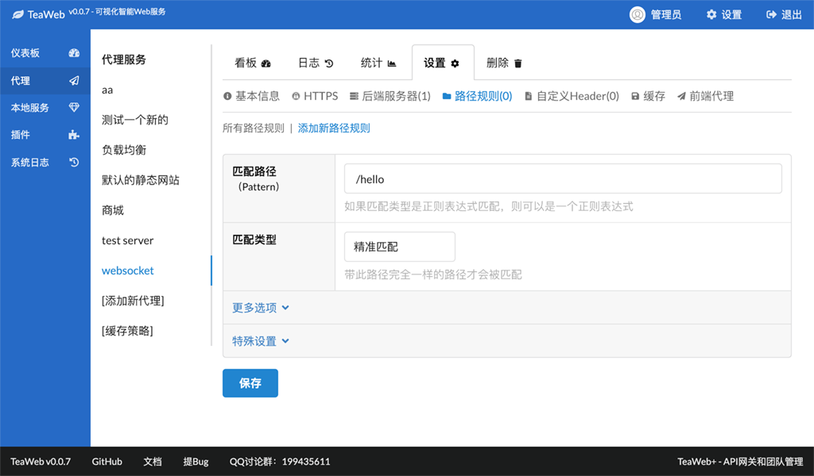
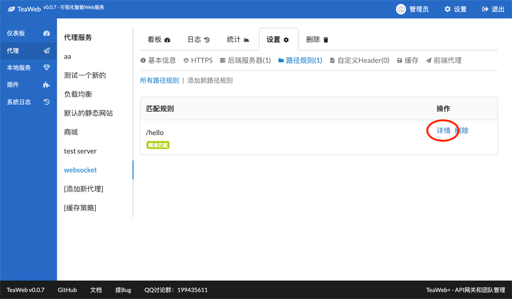
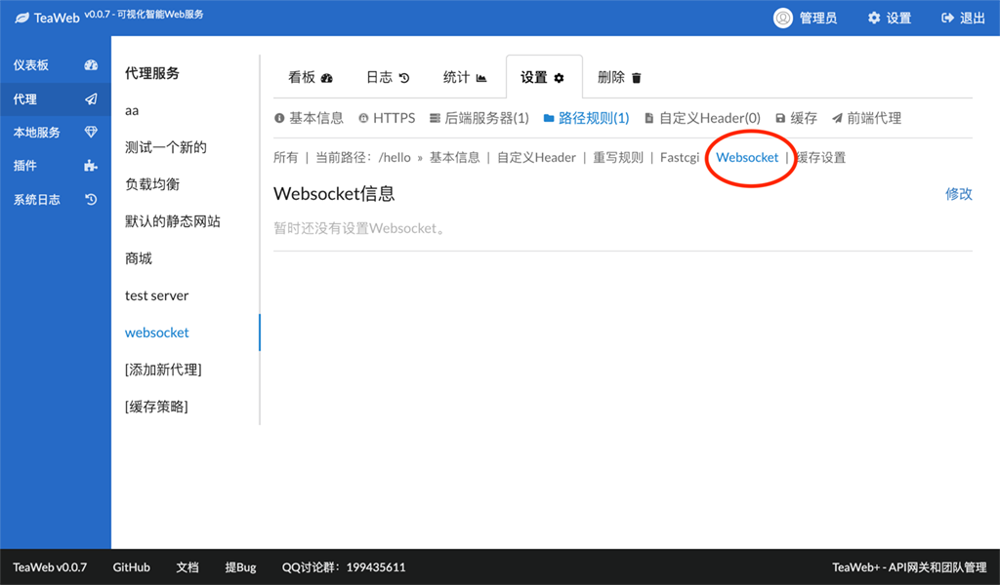
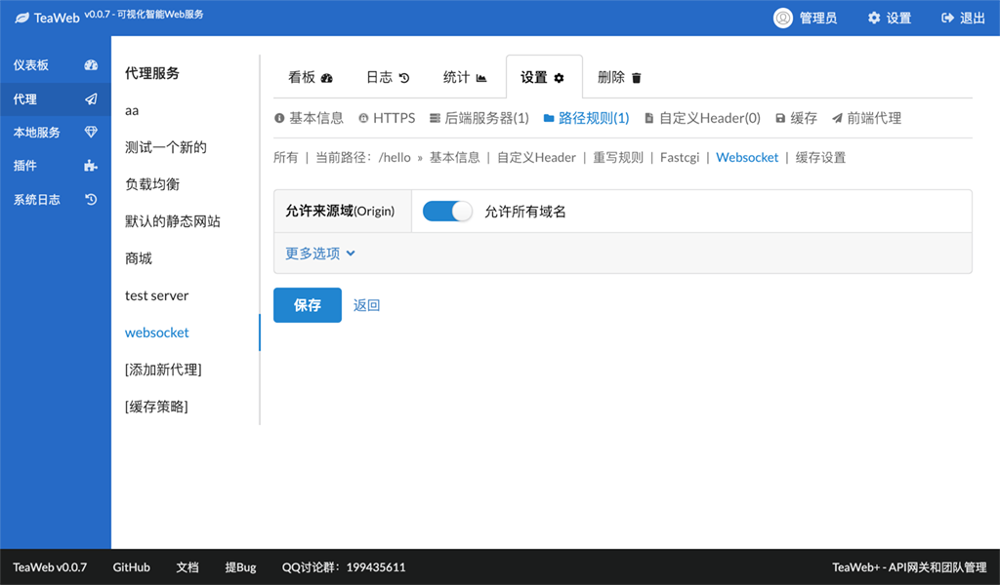
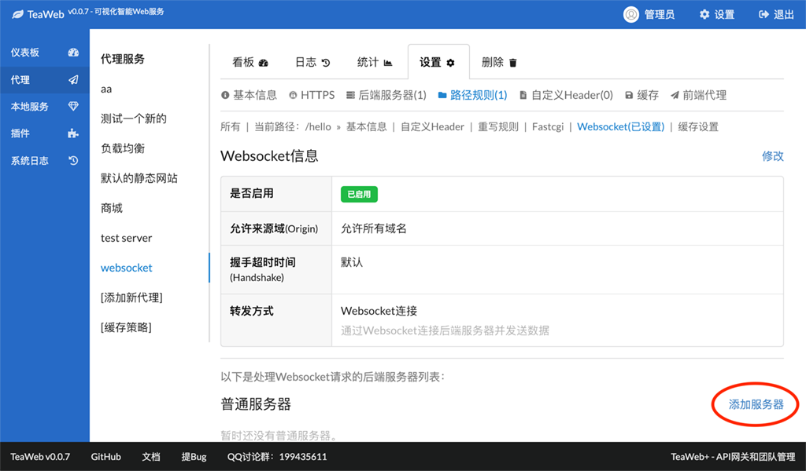
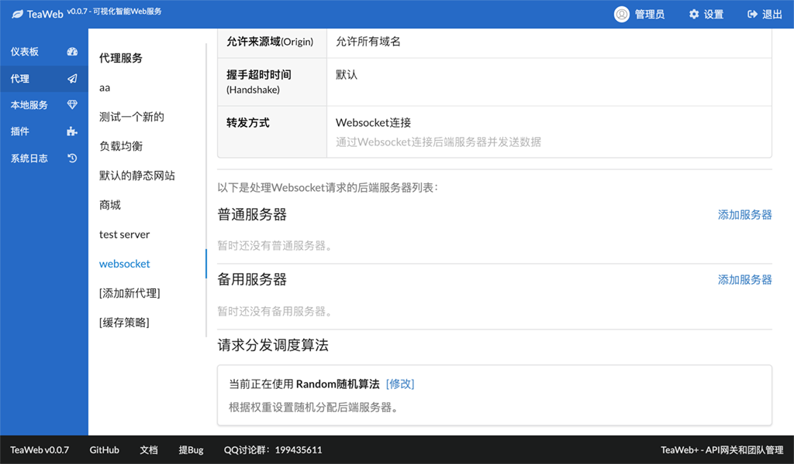
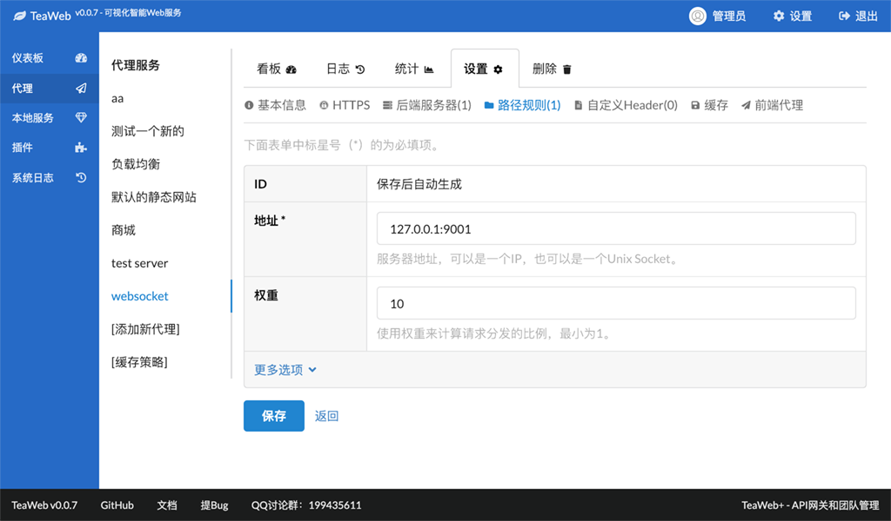
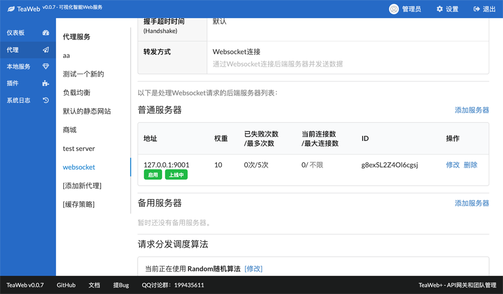
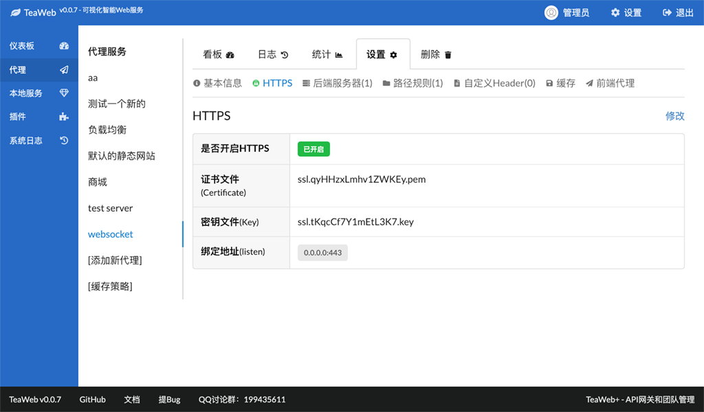

# Websocket
可以使用TeaWeb直接将请求分发到后端的Websocket。

## 步骤1 - 添加路径规则
1. 在"设置"下的"路径规则"页面中点击"添加新路径规则"：

2. 填入一个路径，比如你想通过 `ws://example.com/hello` 来连接Websocket，则要填入 `/hello` ：

3. 点击底部的"保存"，跳转到路径规则列表：

## 步骤2 - 设置Websocket
4. 点击"详情"，然后切换到"Websocket"选项卡：

5. 点击"修改"，进入Websocket设置页面：

你可以在上面界面中关闭掉允许所有域名，然后添加自己的域名。也可以设置握手超时时间、转发方式和是否启用。

6. 然后点击"保存"，跳转回"Websocket"选项卡：

## 步骤3 - 添加后端服务器
7. 点击"添加服务器"可以添加后端服务器，也可以加一组备用服务器，当普通服务器不可用时，会启用备用服务器：

8. 填入后端的服务器地址，在示例中是 `127.0.0.1:9001` ，这个服务器地址提供Websocket或者HTTP请求服务：

9. 然后点击"保存"，跳转回"Websocket"选项卡:

你可以在这界面上调整请求分发调度算法，默认的是"Random随机算法"。

## 测试
根据界面提示，点击重启后生效，然后就可以在网页中使用Javascript进行测试。

比如你的这个代理服务绑定的网络地址是"127.0.0.1:8888"，那么可以在浏览器控制台上尝试以下代码：
~~~javascript
var socket = new WebSocket("ws://127.0.0.1:8888/hello");
socket.onopen = function (event) {
	socket.send("hello");
};
socket.onmessage = function (event) {
	console.log("received:" + event.data);
};
socket.onclose = function (event) {
	console.log("closed");
};
~~~

如果同后端服务器通讯发生了问题，后端服务器列表中会显示失败次数，同时"系统日志"中也会显示一些有用的信息。

## wss协议
要想使用SSL加密的Websocket服务，可以在"HTTPS"中开启HTTPS，即可使用wss协议访问，类似的配置如：

