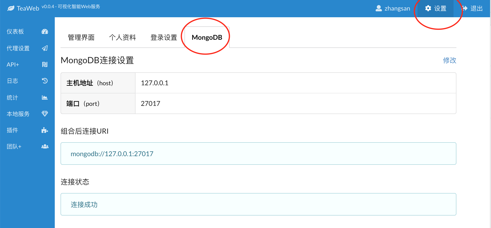
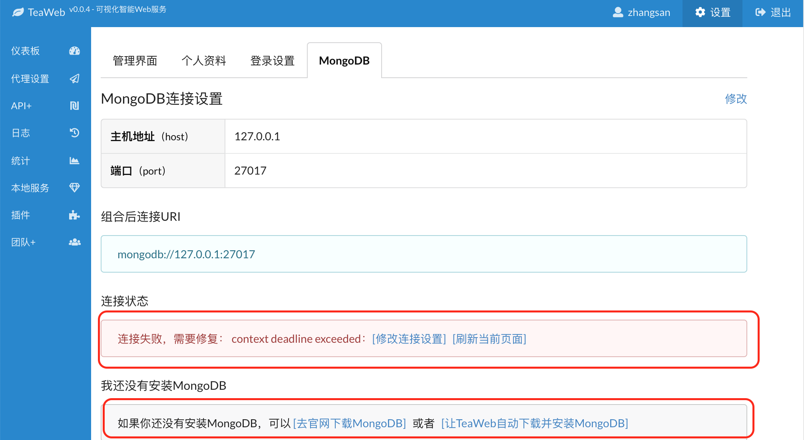

# MongoDB
**注意：目前TeaWeb只支持MongoDB v3.0以上版本，如果你正在使用老的版本，请更换。**

在这里可以修改MongoDB的连接设置：

如果没有安装或者连接失败，则会提示连接失败信息：

如上图所示，如果在项目目录下没有找到已安装的 *mongodb* ，则提示下载链接和自动安装链接。

## 安装和启动MongoDB
如果还没有安装，可以使用TeaWeb帮你安装（"设置">"MongoDB"界面的底部），目前支持Linux和Darwin（Mac OS X）。也可以从 [https://www.mongodb.com/download-center/community](https://www.mongodb.com/download-center/community)下载并安装符合你的系统的MongoDB，或者从TeaOS镜像下载地址中下载：
* [Linux版本](http://dl.teaos.cn/mongodb-linux-x86_64-4.0.3.tgz)
* [Darwin版本](http://dl.teaos.cn/mongodb-osx-ssl-x86_64-4.0.3.tgz)
* [Windows版本](http://dl.teaos.cn/mongodb-win32-x86_64-2008plus-ssl-4.0.8-signed.msi)

在Linux和MacOS上，解压MongoDB安装包后，建议的启动命令为：
~~~bash
cd MongoDB安装目录
bin/mongod --dbpath=./data/ --fork --logpath=./data/fork.log
~~~

启动后，试着用 `ps` 命令查看MongoDB是否已启动：
~~~bash
ps ax|grep mongo
~~~
命令执行结果应该类似于：
~~~
[root@localhost ~]# ps ax|grep mongo
21040 ?        Sl   632:19bin/mongod --dbpath=./data/ --fork --logpath=./data/fork.log
~~~

在Windows上，直接运行下载的可执行文件进行安装，注意过程中可以选择 **不安装** MongoDB Compass。

## 认证
如果你需要使用认证模式连接MongoDB，需要确保用户对`teaweb`数据库有`dbOwner`权限。

* [查看已有用户](#查看已有用户)
* [给用户增加teaweb权限](#给用户增加teaweb权限)
* [创建新用户](#创建新用户)
* [使用认证方式启动MongoDB](#使用认证方式启动mongodb)

### 查看已有用户
使用`show users`来查看查看已有用户、相关权限及认证机制：
~~~
show users
~~~
返回结果：
~~~json
{
	"_id" : "teaweb.用户名",
	"user" : "用户名",
	"db" : "teaweb",
	"roles" : [
		{
			"role" : "dbOwner", // 角色
			"db" : "teaweb" // 数据库固定为teaweb
		}
	],
	"mechanisms" : [
		"SCRAM-SHA-1" // 认证机制
	]
}
~~~

### 给用户增加teaweb权限
给已有用户增加权限（基于角色）：
~~~javascript
db.grantRolesToUser("用户名", [
	{ 
		"role": "dbOwner", 
		"db": "teaweb" 
	}
])
~~~
其中，`db`固定为`teaweb`。

### 创建新用户
如果还没有创建用户，可以使用以下命令创建：
~~~javascript
db.createUser({
	user: "用户名", 
	pwd: "明文密码", 
	roles: [
		{
			role: "dbOwner", 
			db: "teaweb"
		}
	]
})
~~~
其中`用户名`、`明文密码`换成你自己的用户名、密码；`db`固定为`teaweb`。

### 使用认证方式启动MongoDB
通常可以使用`--auth`参数来指定MongoDB的启动方式为启动认证：
~~~
bin/mongod --dbpath=./data/ --fork --logpath=./data/fork.log --auth
~~~