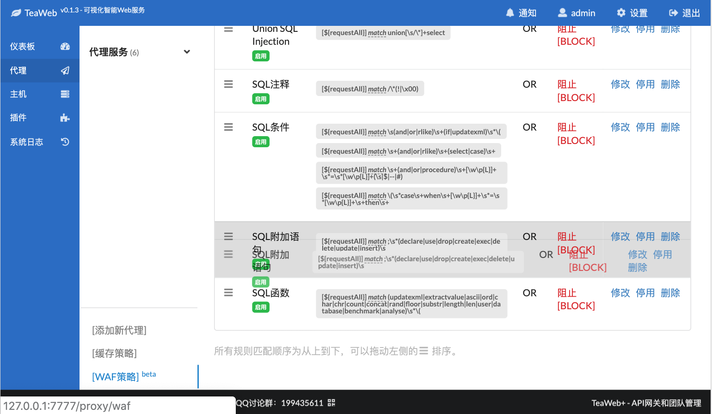

# 定制WAF
可以对WAF进行定制，主要定制方法为添加自己的规则。

## 添加规则
可以在现有的规则集中添加自己的规则，或者新建一个规则分组。

添加规则的相关知识：
* [参数](Checkpoints.md)
* [操作符](Operators.md)
* [正则表达式](Regexp.md)

在TeaWAF中很多时候会直接使用符号来表示规则，比如：
~~~
${requestURI} match /hello
~~~
中的`match`就是正则表达式操作符，`${requestURI}`就是[请求URI参数](Checkpoints.md#请求uri)，`/hello`就是对比值。

## 调整规则顺序
所有的规则分组、规则集、规则都是按顺序执行匹配测试的，可以使用拖动的方法对规则分组、规则集、规则进行排序。

比如要对规则集进行排序，可以拖动左侧的排序图表：

