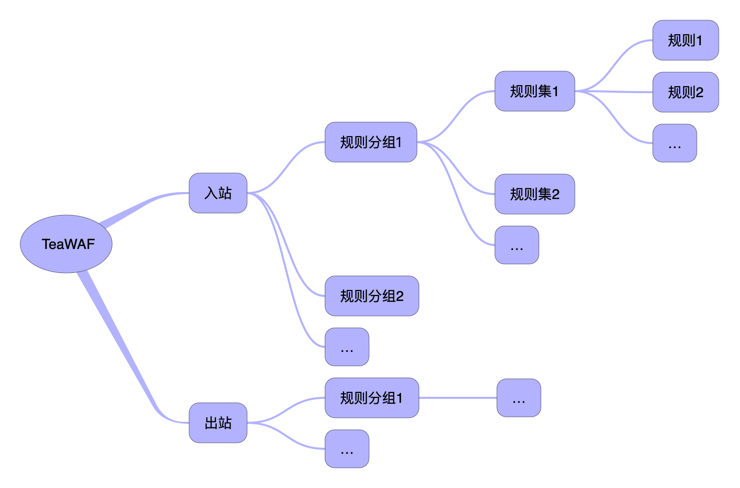
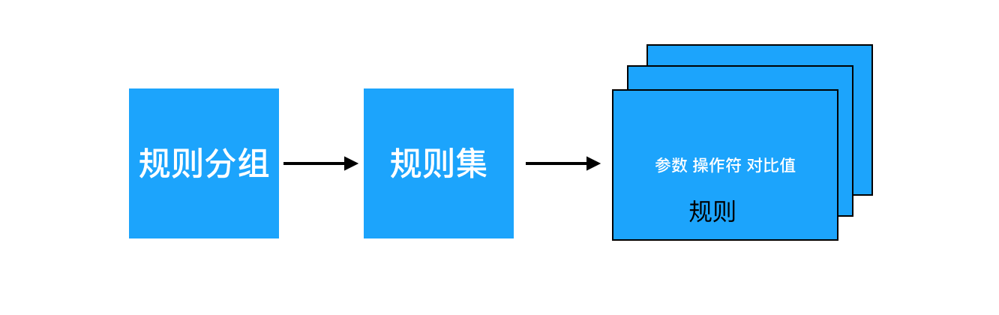

# WAF
从v0.1.3开始，TeaWeb内置了一个简易的基于规则的`TeaWAF`，用于防范XSS跨站攻击、SQL注入等。

## 原理
`WAF`全拼是Web Application Firewall，中文翻译为Web应用防火墙。TeaWAF运行机制如下：

客户端对于实际后端服务器的请求都经过TeaWAF，请求结束后的响应结果也经过TeaWAF，我们把客户端向TeaWAF发起请求称之为`入站`，把TeaWAF将响应数据发送给客户端称之为`出站`，在TeaWAF中可以分别配置入站和入站的规则。

## 规则
TeaWAF的规则结构如下：

规则分组内部执行顺序：

详细说明如下：
* `入站` - 客户端向TeaWAF发起请求的相关规则
* `出站` - TeaWAF将响应数据发送给客户端的相关规则
* `规则分组` - 包含一组规则集，比如SQL注入可能配置多个规则集
* `规则集` - 包含一到多个规则，比如IP黑名单可以添加多个规则，每个规则屏蔽一个IP；多个规则之间的关系有两种：`和`（And，全部都匹配才认为匹配）、`或`（Or有一个匹配即认为匹配）
* `规则` - 每个规则有三个要素组成：
   * `参数` - 要检查的参数，比如"客户端地址"，更多信息在[参数](Checkpoints.md)一节查看
   * `对比值` - 和参数值进行对比的值
   * `操作符` - 参数值和对比值之间的关系，比如大于、小于、包含等，更多信息在[操作符](Operators.md)一节查看

## 使用WAF
可以在[这里](Usage.md)查看如何使用WAF。

## 定制WAF
可以在[这里](Config.md)查看如何定制WAF。