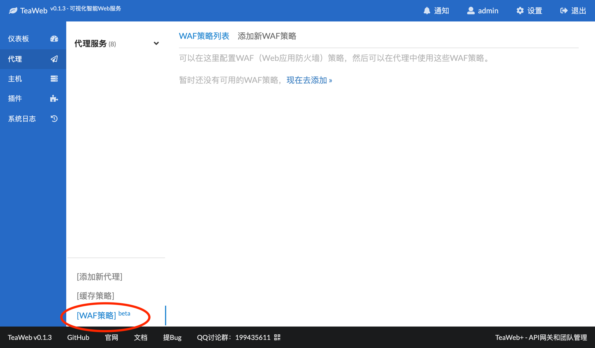
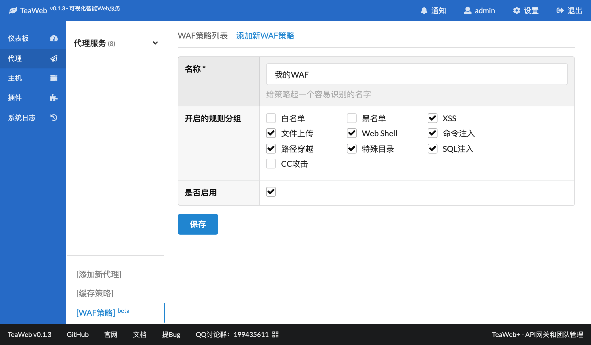
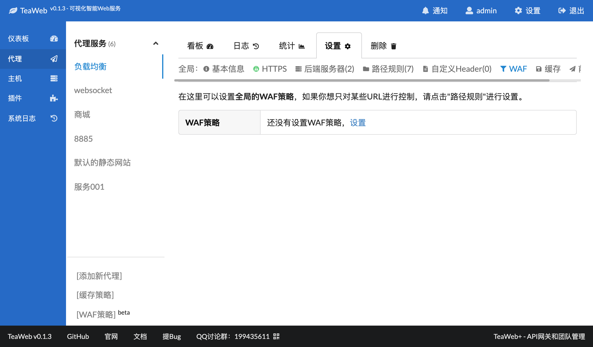
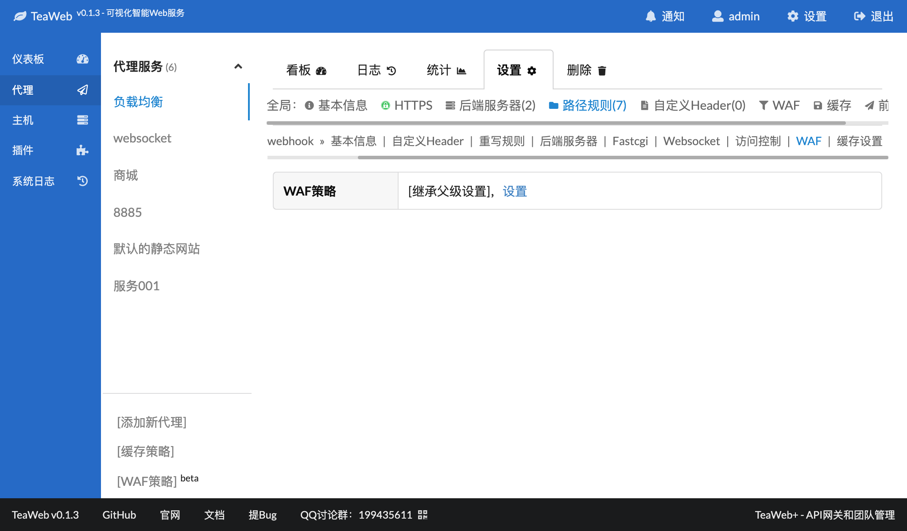

# 使用WAF
要使用一个WAF，步骤为：
1. [添加一个WAF策略](#添加waf策略)
2. 在代理服务或者路径规则中使用此策略

## 添加WAF策略
点击代理界面中的"WAF策略"：

点击右侧的"添加新WAF策略"，进入添加WAF策略表单：

填入一个名称，选择默认开启的内置规则分组，点击保存后即可完成添加：

添加完成后，就可以进入下面的使用此策略的环节。

## 在代理服务中使用WAF
在某个代理服务中，可以在"WAF"菜单中设置WAF：

## 在路径规则中使用WAF
在某个路径规则中，可以在"WAF"菜单中设置此路径规则单独的WAF：

设置时，需要看清楚界面，记得不要和代理服务的WAF弄混了。

## 测试WAF
设置WAF后，在浏览器上访问：
~~~
http://你的代理服务地址/?id=<script src="">
~~~
就会提示：
~~~
The request is blocked by TeaWAF
~~~
说明WAF生效了。